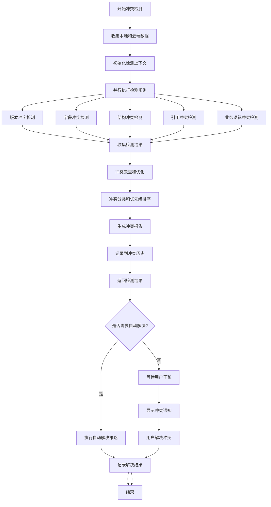
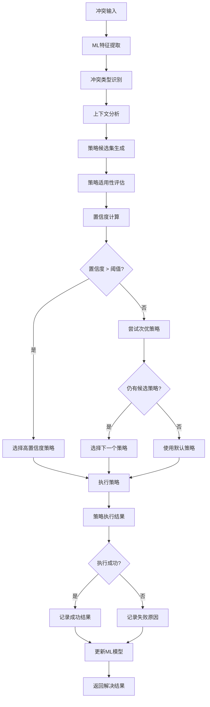
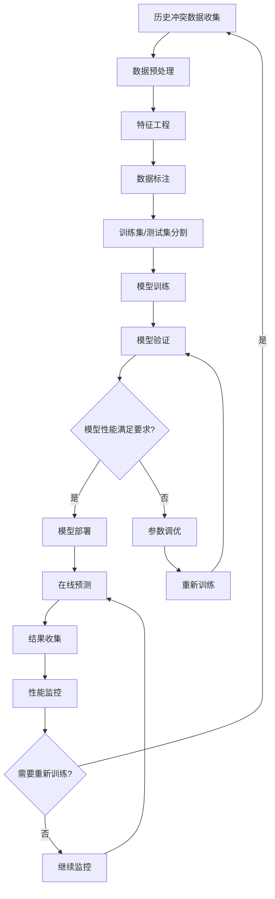
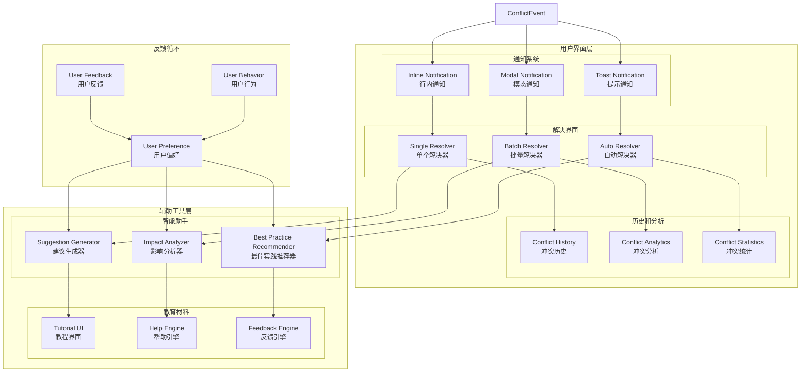

# 统一冲突解决架构图

## 📐 完整架构图

```mermaid
graph TB
    %% 核心组件
    subgraph "统一冲突解决架构"
        UCRM[UnifiedConflictResolutionManager<br/>统一冲突解决管理器]
        
        subgraph "检测引擎层"
            CD[ConflictDetector<br/>冲突检测引擎]
            VCD[VersionConflictDetector<br/>版本冲突检测]
            FCD[FieldConflictDetector<br/>字段冲突检测]
            SCD[StructureConflictDetector<br/>结构冲突检测]
            RCD[ReferenceConflictDetector<br/>引用冲突检测]
            BCD[BusinessLogicConflictDetector<br/>业务逻辑冲突检测]
        end
        
        subgraph "策略引擎层"
            SE[StrategyEngine<br/>策略引擎]
            TS[TimestampStrategy<br/>时间戳策略]
            CDS[ContentDiffStrategy<br/>内容差异策略]
            SA[SemanticAnalysisStrategy<br/>语义分析策略]
            UP[UserPatternStrategy<br/>用户行为策略]
            NA[NetworkAwareStrategy<br/>网络感知策略]
        end
        
        subgraph "合并引擎层"
            ME[MergeEngine<br/>合并引擎]
            STM[SmartTextMerge<br/>智能文本合并]
            FM[FieldMerge<br/>字段合并]
            SM[StructureMerge<br/>结构合并]
            SEM[SemanticMerge<br/>语义合并]
        end
        
        subgraph "机器学习层"
            MLE[MLEngine<br/>机器学习引擎]
            FE[FeatureExtractor<br/>特征提取]
            CP[ConflictPredictor<br/>冲突预测器]
            SR[StrategyRecommender<br/>策略推荐器]
            TM[TrainingModel<br/>训练模型]
        end
        
        subgraph "支持服务层"
            CC[ConflictCache<br/>冲突缓存]
            EB[EventBus<br/>事件总线]
            CA[ConflictAnalytics<br/>冲突分析]
            CM[ConfigManager<br/>配置管理]
        end
    end
    
    %% 数据流
    subgraph "数据输入"
        LD[LocalData<br/>本地数据]
        CD2[CloudData<br/>云端数据]
        BD[BaseData<br/>基础数据]
    end
    
    subgraph "上下文信息"
        NS[NetworkState<br/>网络状态]
        UC[UserContext<br/>用户上下文]
        SH[SyncHistory<br/>同步历史]
    end
    
    subgraph "输出结果"
        CR[ConflictResolution<br/>冲突解决结果]
        MR[MergedResult<br/>合并结果]
        UR[UserResolution<br/>用户解决]
    end
    
    %% 连接关系
    LD --> CD
    CD2 --> CD
    BD --> CD
    NS --> CD
    UC --> CD
    SH --> CD
    
    CD --> UCRM
    UCRM --> SE
    UCRM --> ME
    UCRM --> MLE
    
    SE --> TS
    SE --> CDS
    SE --> SA
    SE --> UP
    SE --> NA
    
    ME --> STM
    ME --> FM
    ME --> SM
    ME --> SEM
    
    MLE --> FE
    MLE --> CP
    MLE --> SR
    MLE --> TM
    
    UCRM --> CC
    UCRM --> EB
    UCRM --> CA
    UCRM --> CM
    
    UCRM --> CR
    UCRM --> MR
    UCRM --> UR
    
    %% 反馈循环
    CR -.-> CA
    MR -.-> MLE
    UR -.-> SE
```



## 🔍 冲突检测详细流程



## 🧠 策略选择流程



## 🔄 机器学习训练流程



## 🎯 性能优化架构

```mermaid
flowchart TB
    subgraph "性能优化层"
        subgraph "缓存优化"
            L1[L1缓存<br/>内存缓存<br/>TTL: 5分钟]
            L2[L2缓存<br/>IndexedDB缓存<br/>TTL: 30分钟]
            L3[L3缓存<br/>Service Worker缓存<br/>TTL: 2小时]
        end
        
        subgraph "并行处理"
            WP[Worker Pool<br/>工作线程池]
            TQ[Task Queue<br/>任务队列]
            LB[Load Balancer<br/>负载均衡]
        end
        
        subgraph "智能批处理"
            BS[Batch Scheduler<br/>批处理调度器]
            BO[Batch Optimizer<br/>批处理优化器]
            BP[Batch Processor<br/>批处理器]
        end
    end
    
    subgraph "监控层"
        PM[Performance Monitor<br/>性能监控]
            MM[Memory Monitor<br/>内存监控]
            CM[CPU Monitor<br/>CPU监控]
            NM[Network Monitor<br/>网络监控]
        end
        
        LA[Logger & Analytics<br/>日志分析]
            EL[Event Logger<br/>事件日志]
            PL[Performance Logger<br/>性能日志]
            AL[Analytics Logger<br/>分析日志]
        end
    end
    
    %% 数据流
    ConflictInput --> BS
    BS --> BO
    BO --> BP
    BP --> TQ
    TQ --> WP
    WP --> LB
    
    %% 缓存层
    WP --> L1
    L1 --> L2
    L2 --> L3
    
    %% 监控
    WP --> PM
    PM --> MM
    PM --> CM
    PM --> NM
    
    WP --> LA
    LA --> EL
    LA --> PL
    LA --> AL
```

## 👥 用户体验架构



---

**架构图版本**: v1.0.0  
**创建时间**: 2025-09-13  
**设计工具**: Mermaid  
**用途**: 技术架构文档和开发指导