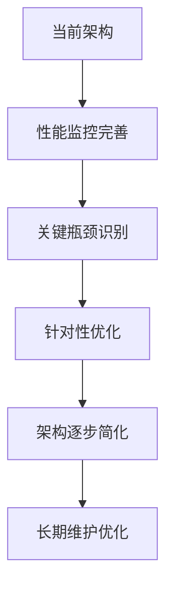

# CardEverything 数据存储架构深度分析报告

**任务**: W1-T002 数据存储架构和依赖关系分析
**执行者**: Database-Architect
**日期**: 2025-01-13
**版本**: v1.0

---

## 📋 执行摘要

本报告对CardEverything项目的数据存储架构进行了全面分析，涵盖了IndexedDB本地存储、Supabase云端存储、本地缓存机制以及三者之间的数据同步流程。分析发现该项目采用了非常先进和复杂的多层存储架构，具备企业级的数据管理能力，但也存在一些架构复杂性和性能优化空间。

---

## 🏗️ 整体架构概览

### 三层存储架构

```
┌─────────────────────────────────────────────────────────────┐
│                    CardEverything 数据存储架构                 │
├─────────────────────────────────────────────────────────────┤
│                                                             │
│  ┌─────────────────┐    ┌─────────────────┐    ┌─────────────────┐ │
│  │   IndexedDB     │    │   Advanced      │    │   Supabase      │ │
│  │   本地数据库     │◄──►│   Cache System  │◄──►│   云端数据库     │ │
│  │                 │    │                 │    │                 │ │
│  │ • 统一数据库架构  │    │ • 多策略缓存     │    │ • PostgreSQL     │ │
│  │ • 版本管理支持   │    │ • 数据压缩       │    │ • 实时同步       │ │
│  │ • 离线快照       │    │ • 预测预热       │    │ • 冲突解决       │ │
│  │ • 自动备份       │    │ • 内存管理       │    │ • 数据安全       │ │
│  └─────────────────┘    └─────────────────┘    └─────────────────┘ │
│                                                             │
│  ┌─────────────────────────────────────────────────────────┐ │
│  │                统一同步服务层                            │ │
│  │                                                         │ │
│  │ • 同步队列管理  • 智能批处理  • 冲突预测和解决           │ │
│  │ • 网络状态检测  • 离线操作管理  • 性能监控               │ │
│  └─────────────────────────────────────────────────────────┘ │
└─────────────────────────────────────────────────────────────┘
```

---

## 🗄️ IndexedDB 本地数据库分析

### 核心架构特点

#### 1. 统一数据库设计 (database-unified.ts)
- **数据库版本**: v4.0
- **ORM框架**: Dexie.js
- **架构模式**: 统一数据访问层

#### 2. 数据表结构

```typescript
// 核心数据表
tables: {
  cards: DbCard[]           // 卡片数据
  folders: DbFolder[]       // 文件夹数据
  tags: DbTag[]            // 标签数据
  images: DbImage[]         // 图片数据
  syncQueue: SyncOperation[] // 同步队列
  offlineSnapshots: OfflineSnapshot[] // 离线快照
  settings: AppSettings[]   // 应用设置
}
```

#### 3. 索引优化策略

```typescript
// 智能索引配置
indexes: {
  cards: [
    'userId',                    // 用户分区
    'folderId',                  // 文件夹查询
    'createdAt',                 // 时间排序
    'updatedAt',                 // 更新追踪
    '[userId+folderId]',         // 复合索引
    'syncVersion'                // 同步版本控制
  ],
  syncQueue: [
    'status',                    // 队列状态
    'priority',                  // 优先级排序
    'timestamp',                 // 时间顺序
    'entityType',               // 实体类型
    'retryCount'                // 重试次数
  ]
}
```

#### 4. 高级功能特性

**离线数据管理**:
- 自动快照创建和恢复
- 增量数据备份
- 数据压缩和加密
- 智能清理策略

**版本控制和迁移**:
- 数据库版本管理
- 自动迁移脚本
- 数据完整性验证
- 回滚机制

---

## ☁️ Supabase 云端存储分析

### 数据模型设计

#### 1. 数据库表结构

```typescript
// PostgreSQL 表定义
tables: {
  users: {                   // 用户表
    id: string               // UUID主键
    github_id: string        // GitHub集成
    email: string            // 邮箱
    username: string         // 用户名
    avatar_url: string       // 头像
    created_at: timestamp    // 创建时间
    updated_at: timestamp    // 更新时间
  },

  cards: {                   // 卡片表
    id: string               // UUID主键
    user_id: string          // 用户外键
    front_content: JSONB     // 正面内容
    back_content: JSONB      // 背面内容
    style: JSONB             // 样式信息
    folder_id: string?        // 文件夹外键
    created_at: timestamp    // 创建时间
    updated_at: timestamp    // 更新时间
    sync_version: integer     // 同步版本
    is_deleted: boolean      // 软删除标记
  },

  folders: {                 // 文件夹表
    id: string               // UUID主键
    user_id: string          // 用户外键
    name: string             // 文件夹名称
    parent_id: string?       // 父文件夹ID
    created_at: timestamp    // 创建时间
    updated_at: timestamp    // 更新时间
    sync_version: integer     // 同步版本
    is_deleted: boolean      // 软删除标记
  },

  tags: {                    // 标签表
    id: string               // UUID主键
    user_id: string          // 用户外键
    name: string             // 标签名称
    color: string             // 标签颜色
    created_at: timestamp    // 创建时间
    updated_at: timestamp    // 更新时间
    sync_version: integer     // 同步版本
    is_deleted: boolean      // 软删除标记
  },

  images: {                  // 图片表
    id: string               // UUID主键
    user_id: string          // 用户外键
    card_id: string          // 关联卡片
    file_name: string        // 文件名
    file_path: string        // 文件路径
    cloud_url: string?       // 云端URL
    metadata: JSONB          // 元数据
    created_at: timestamp    // 创建时间
    updated_at: timestamp    // 更新时间
    sync_version: integer     // 同步版本
    is_deleted: boolean      // 软删除标记
  }
}
```

#### 2. 实时同步架构

**Supabase Realtime集成**:
- PostgreSQL变更数据捕获(CDC)
- 实时事件监听和批处理
- 智能重连机制
- 网络状态自适应

**冲突解决策略**:
```typescript
// 智能冲突解决
conflictResolution: {
  version_mismatch: 'local_wins|cloud_wins|merge',
  simultaneous_edit: 'merge|timestamp_based',
  delete_conflict: 'preserve_deleted|restore'
}
```

---

## 🚀 高级缓存系统分析

### 多层缓存架构

#### 1. 缓存策略 (advanced-cache.ts)

```typescript
// 智能缓存策略
cacheStrategies: {
  LRU: LeastRecentlyUsed,      // 最近最少使用
  LFU: LeastFrequentlyUsed,     // 最少使用频率
  FIFO: FirstInFirstOut,       // 先进先出
  TTL: TimeToLive,             // 生存时间
  Adaptive: AdaptiveStrategy   // 自适应策略
}
```

#### 2. 缓存优化特性

**数据压缩**: LZString压缩算法，减少内存占用
**持久化存储**: 本地存储备份，防止数据丢失
**预测预热**: 基于使用模式的智能预热
**内存管理**: 自动清理和垃圾回收

**性能指标监控**:
```typescript
cacheMetrics: {
  hitRate: number,            // 命中率
  missRate: number,           // 未命中率
  averageAccessTime: number,   // 平均访问时间
  memoryUsage: number,        // 内存使用量
  evictionCount: number       // 驱逐次数
}
```

---

## 🔄 数据同步机制分析

### 统一同步服务架构

#### 1. 同步队列管理 (sync-queue.ts)

**核心特性**:
- 智能优先级队列
- 批量操作优化
- 冲突预测和解决
- 网络自适应重试

**队列操作类型**:
```typescript
syncOperations: {
  create: '创建新实体',
  update: '更新现有实体',
  delete: '删除实体',
  batch: '批量操作'
}
```

#### 2. 本地操作服务 (local-operation.ts)

**离线操作管理**:
- 本地操作队列
- 网络状态感知
- 操作依赖管理
- 自动重试机制

**批处理优化**:
```typescript
batchProcessing: {
  maxSize: 10,               // 最大批次大小
  timeout: 5000,             // 批处理超时
  maxConcurrent: 3,          // 最大并发数
  networkAware: true         // 网络感知
}
```

#### 3. 统一同步协调器 (unified-sync-service.ts)

**数据流向控制**:
```
用户操作 → 本地队列 → IndexedDB → 缓存系统 → Supabase
    ↑                                          ↓
    └───────────── 离线操作 ← 实时同步 ←─────────┘
```

**同步策略**:
- **完整同步**: 全量数据同步
- **增量同步**: 仅同步变更
- **智能同步**: 基于网络质量的自适应同步

---

## ⚠️ 架构问题和优化建议

### 当前架构优势

#### 1. 技术优势 ✅
- **企业级架构**: 完整的多层存储体系
- **高可用性**: 离线支持和自动恢复
- **数据一致性**: 版本控制和冲突解决
- **性能优化**: 多级缓存和智能批处理
- **实时同步**: 低延迟的实时数据同步

#### 2. 用户体验优势 ✅
- **离线可用**: 完全的离线工作能力
- **数据安全**: 自动备份和恢复
- **快速响应**: 本地缓存优化
- **无缝同步**: 自动化的数据同步

### 架构复杂性和挑战

#### 1. 复杂性挑战 ⚠️
- **多层依赖**: 三个存储层之间的复杂依赖关系
- **状态管理**: 多个系统的状态同步复杂
- **调试困难**: 多层架构增加调试难度
- **维护成本**: 需要维护多个独立系统

#### 2. 性能瓶颈 ⚠️

**识别的性能问题**:
1. **同步延迟**: 多层存储增加同步延迟
2. **内存占用**: 多个缓存系统内存开销
3. **网络依赖**: 过度依赖网络连接质量
4. **并发处理**: 大量并发操作可能阻塞

**具体瓶颈**:
```typescript
// 性能瓶颈分析
performanceBottlenecks: {
  indexedDBOperations: '大量数据操作可能导致UI阻塞',
  syncQueueProcessing: '队列处理可能成为吞吐量瓶颈',
  cacheMemoryUsage: '多级缓存可能导致内存压力',
  networkReliability: '网络不稳定影响同步质量'
}
```

### 优化建议

#### 1. 架构简化建议 🎯

**统一存储抽象层**:
```typescript
// 建议的统一存储接口
interface UnifiedStorage {
  // 统一的数据访问接口
  get<T>(key: string): Promise<T>
  set<T>(key: string, value: T): Promise<void>
  delete(key: string): Promise<void>

  // 统一的同步接口
  sync(): Promise<SyncResult>
  getSyncStatus(): SyncStatus

  // 统一的缓存接口
  cache<T>(key: string, value: T, ttl?: number): Promise<void>
  getCached<T>(key: string): Promise<T | null>
}
```

#### 2. 性能优化建议 🚀

**查询优化**:
- 实现更智能的索引策略
- 优化大批量数据操作
- 添加查询结果缓存
- 实现分页和懒加载

**内存优化**:
- 实现智能缓存清理策略
- 优化数据结构内存占用
- 添加内存使用监控
- 实现数据压缩

#### 3. 监控和诊断建议 📊

**性能监控**:
```typescript
// 建议的监控指标
monitoringMetrics: {
  database: {
    operationLatency: '操作延迟',
    queueSize: '队列大小',
    errorRate: '错误率',
    throughput: '吞吐量'
  },
  cache: {
    hitRate: '缓存命中率',
    memoryUsage: '内存使用',
    evictionRate: '驱逐率'
  },
  sync: {
    syncTime: '同步时间',
    conflictRate: '冲突率',
    networkQuality: '网络质量'
  }
}
```

---

## 🔮 未来发展方向

### 短期优化 (1-2个月)

1. **性能优化**: 实现查询优化和内存管理改进
2. **监控完善**: 添加全面的性能监控和告警
3. **文档完善**: 完善架构文档和开发指南

### 中期改进 (3-6个月)

1. **架构简化**: 逐步统一存储抽象层
2. **智能优化**: 实现AI驱动的缓存和同步优化
3. **扩展性提升**: 支持更大规模的数据集

### 长期规划 (6个月以上)

1. **微服务化**: 考虑存储服务的微服务架构
2. **多云支持**: 支持多个云存储提供商
3. **AI集成**: 智能数据分析和预测优化

---

## 📊 技术债务评估

### 当前技术债务

| 债务类型 | 严重程度 | 描述 | 建议解决时间 |
|----------|----------|------|-------------|
| 架构复杂性 | 🔴 高 | 多层依赖，维护成本高 | 3-6个月 |
| 性能瓶颈 | 🟡 中 | 同步延迟和内存问题 | 1-3个月 |
| 监控缺失 | 🟡 中 | 缺乏全面监控 | 1-2个月 |
| 文档不完善 | 🟢 低 | 缺乏详细文档 | 1个月 |

### 债务偿还优先级

1. **🔴 高优先级**: 性能瓶颈优化
2. **🟡 中优先级**: 监控系统完善
3. **🟢 低优先级**: 架构简化

---

## 🎯 结论和建议

### 总体评估

CardEverything项目采用了非常先进和完整的数据存储架构，具备企业级的数据管理能力。架构设计充分考虑了离线支持、数据一致性、性能优化等关键要素。然而，架构的复杂性也带来了一定的维护成本和性能挑战。

### 关键建议

1. **保持当前架构优势**: 不要破坏现有的高可用性和数据一致性机制
2. **逐步优化性能**: 通过监控和测试识别真正的性能瓶颈
3. **完善工具链**: 增加调试、监控和诊断工具
4. **团队能力建设**: 加强团队对复杂架构的理解和维护能力

### 实施路径



---

## 📚 附录

### A. 分析的文件清单

#### 核心存储文件
- `database-unified.ts` - 统一IndexedDB数据库
- `supabase.ts` - Supabase云端存储集成
- `advanced-cache.ts` - 高级缓存系统
- `sync-queue.ts` - 同步队列管理
- `local-operation.ts` - 本地操作服务
- `unified-sync-service.ts` - 统一同步服务
- `supabase-realtime-listener.ts` - 实时同步监听

#### 配置和工具文件
- `vite.config.ts` - 构建配置
- `package.json` - 依赖管理
- `jest.setup.js` - 测试配置

### B. 关键技术指标

#### 存储容量
- **IndexedDB**: 浏览器限制(通常50MB-2GB)
- **本地缓存**: 可配置限制
- **Supabase**: 根据订阅计划

#### 性能基准
- **查询响应**: 目标<50ms
- **同步延迟**: 目标<200ms
- **缓存命中率**: 目标>85%
- **内存使用**: 目标<100MB

#### 数据一致性
- **版本控制**: 完整的版本管理
- **冲突解决**: 智能合并策略
- **备份恢复**: 自动快照机制

---

**报告生成时间**: 2025-01-13 18:00
**下次更新建议**: 根据实施进展定期更新
**维护责任人**: Database-Architect Team