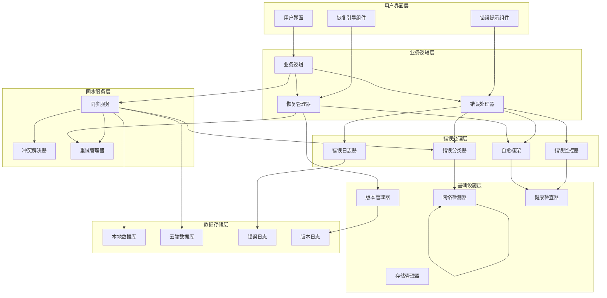
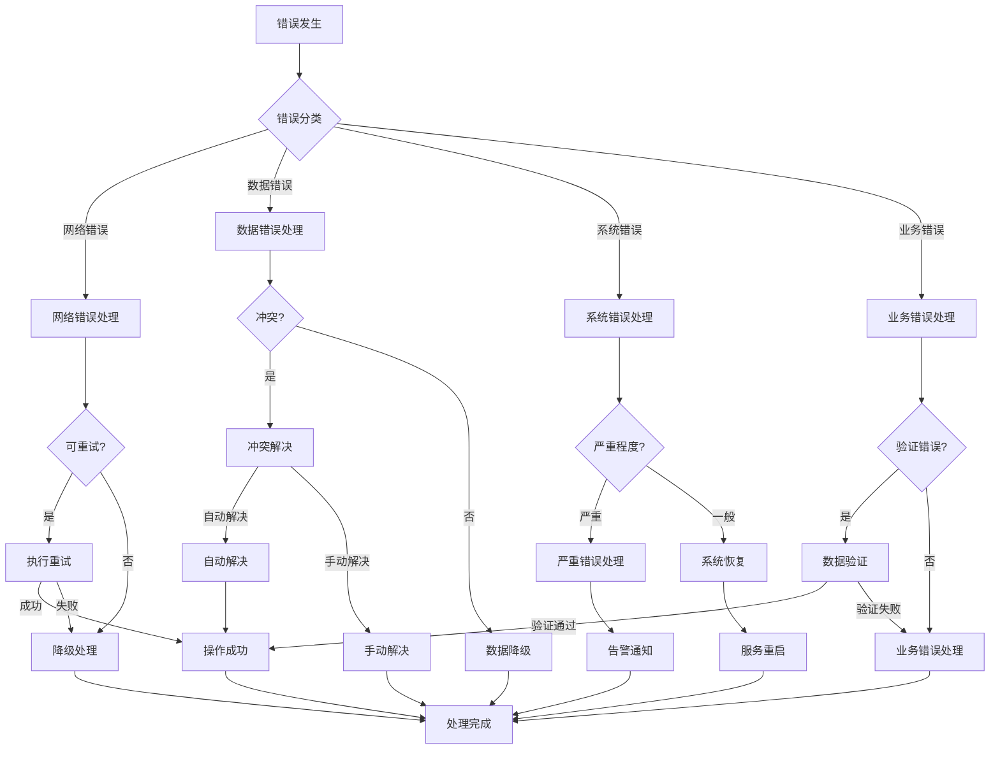
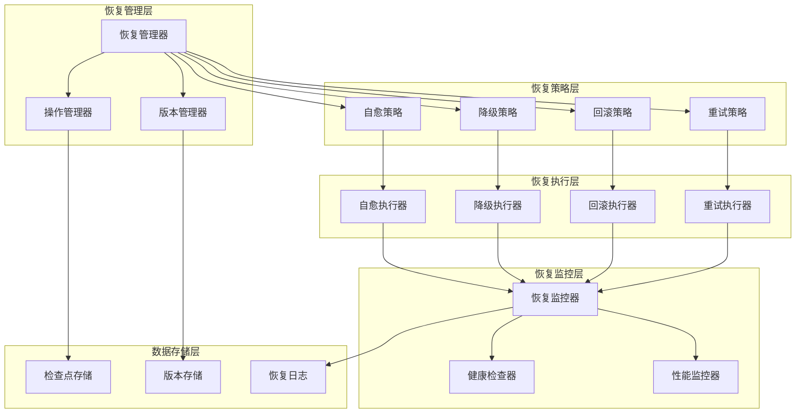
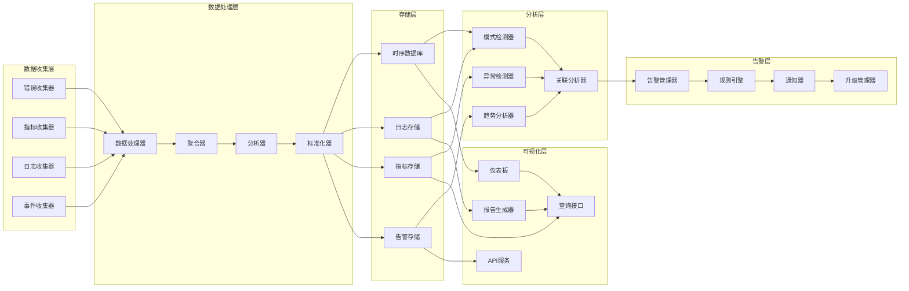
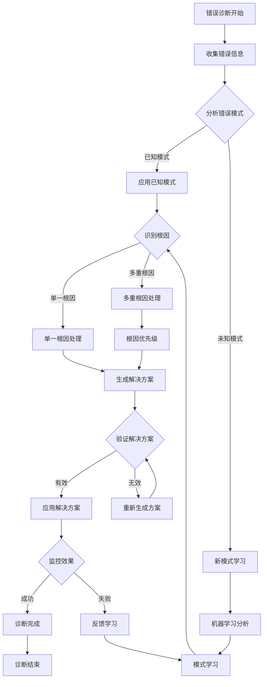
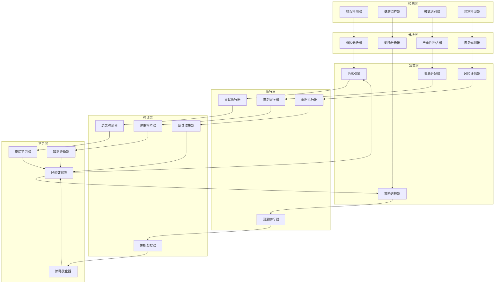

# 错误处理架构图

## 整体架构图



## 错误处理流程图



## 恢复机制架构图



## 监控系统架构图



## 错误诊断流程图



## 系统自愈架构图



## 实施时间线图

```mermaid
gantt
    title 错误处理机制实施时间线
    dateFormat  YYYY-MM-DD
    section 第一阶段：基础设施
    错误分类系统       ：active, des1, 2025-09-13, 7d
    错误处理中间件     ：active, des2, after des1, 7d
    日志系统          ：active, des3, after des2, 7d

    section 第二阶段：恢复机制
    智能重试         ：active, des4, after des3, 10d
    断点续传         ：active, des5, after des4, 7d
    数据回滚         ：active, des6, after des5, 7d

    section 第三阶段：监控诊断
    监控系统         ：active, des7, after des6, 10d
    诊断工具         ：active, des8, after des7, 7d
    仪表板          ：active, des9, after des8, 7d

    section 第四阶段：测试优化
    单元测试         ：active, des10, after des9, 7d
    集成测试         ：active, des11, after des10, 7d
    压力测试         ：active, des12, after des11, 7d
    性能优化         ：active, des13, after des12, 7d
    文档完善         ：active, des14, after des13, 7d
```

---

*架构图版本：v1.0*
*创建时间：2025-09-13*