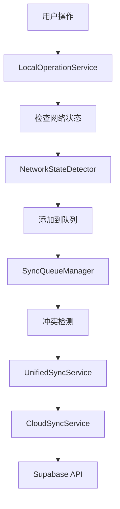
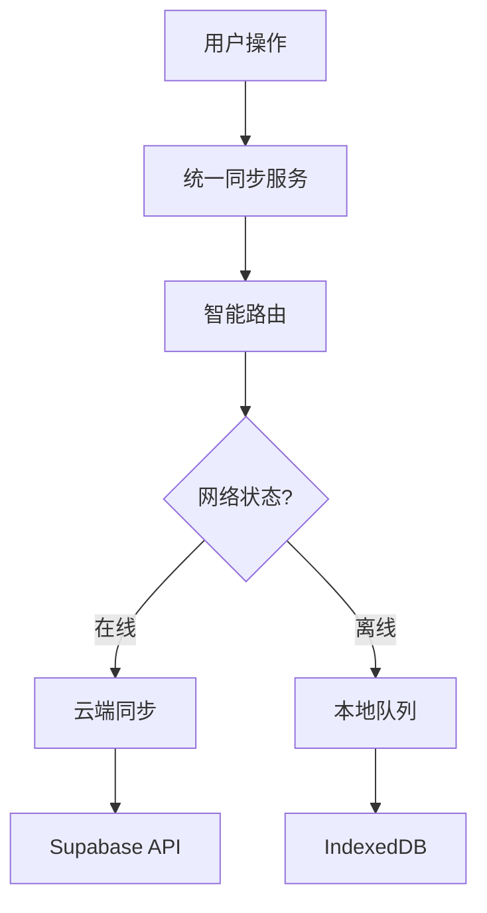

# 同步服务架构深度分析报告

## 执行概要

本报告对CardEverything项目的三个主要同步服务进行了全面的架构分析，识别了关键问题、冗余模式、以及优化机会。通过系统性的代码审查，我们发现存在显著的架构复杂性和功能重叠，需要通过统一同步服务来解决。

## 分析的同步服务

### 1. CloudSyncService (`cloud-sync.ts`)
- **行数**: 703行
- **主要职责**: 基础云端同步功能
- **复杂度**: 中等

### 2. OptimizedCloudSyncService (`optimized-cloud-sync.ts`)
- **行数**: 1,166行
- **主要职责**: 优化的云端同步服务
- **复杂度**: 高

### 3. UnifiedSyncService (`unified-sync-service.ts`)
- **行数**: 1,178行
- **主要职责**: 统一同步服务整合层
- **复杂度**: 非常高

## 架构问题分析

### 🔴 严重问题

#### 1. 职责重叠和功能冗余
```typescript
// 三个服务都有相似的同步操作
cloud-sync.ts:          async performFullSync(): Promise<void>
optimized-cloud-sync.ts: async performFullSync(): Promise<void>
unified-sync-service.ts: async performFullSync(): Promise<void>
```

**问题影响**:
- 维护成本增加3倍
- 功能不一致风险
- 测试覆盖率分散

#### 2. 循环依赖风险
```typescript
// cloud-sync.ts
import { networkStateDetector } from './network-state-detector'

// unified-sync-service.ts
import { networkStateDetector } from './network-state-detector'
import { localOperationService } from './local-operation'
import { syncQueueManager } from './sync-queue'

// local-operation.ts
async executeBatchSync(operations, batchId) {
  const { unifiedSyncService } = await import('./unified-sync-service')
}
```

#### 3. 接口不一致
三个服务使用不同的操作接口：
- `SyncOperation` (cloud-sync.ts)
- `LocalSyncOperation` (local-operation.ts)
- `UnifiedSyncOperation` (unified-sync-service.ts)
- `QueueOperation` (sync-queue.ts)

### 🟡 中等问题

#### 4. 配置分散
同步配置分散在多个服务中：
```typescript
// cloud-sync.ts - 固定配置
setInterval(() => {
  if (currentState.canSync && this.authService?.isAuthenticated()) {
    this.processSyncQueue()
  }
}, syncInterval) // 5分钟

// optimized-cloud-sync.ts - 动态策略
const syncStrategies: Map<string, SyncStrategy> = new Map()

// unified-sync-service.ts - 混合配置
private getAdaptiveSyncInterval(): number
```

#### 5. 错误处理不统一
```typescript
// cloud-sync.ts - 简单错误处理
try {
  await this.executeOperation(operation)
} catch (error) {
  console.error('Sync operation failed:', error)
  operation.retryCount++
}

// optimized-cloud-sync.ts - 复杂错误处理
private async resolveConflicts(conflicts): Promise<ConflictInfo[]> {
  // 智能冲突解决策略
}

// unified-sync-service.ts - 集成错误处理
private handleNetworkError(error: any, context?: string): void
```

#### 6. 性能监控碎片化
每个服务都有自己的性能指标：
- CloudSyncService: 基础统计
- OptimizedCloudSyncService: 详细指标
- UnifiedSyncService: 综合指标

### 🟢 轻微问题

#### 7. 代码重复
相似的功能在多个服务中重复实现：
- 网络状态检测
- 冲突解决
- 批处理逻辑
- 缓存管理

#### 8. 测试复杂性
由于服务间的复杂依赖关系，单元测试和集成测试变得困难。

## 依赖关系图

```
┌─────────────────────┐
│  UnifiedSyncService │
│      (1,178 lines)   │
└─────────┬───────────┘
          │
          ├──────────────────────────────┐
          │                              │
┌─────────▼───────────┐      ┌────────▼─────────┐
│ LocalOperationService│      │SyncQueueManager  │
│     (1,246 lines)   │      │   (1,511 lines)  │
└─────────┬───────────┘      └────────┬─────────┘
          │                              │
          └──────────┐ ┌───────────────────┘
                     │ │
          ┌─────────▼─▼─▼─────────────────┐
          │ NetworkStateDetector         │
          │     (1,105 lines)             │
          └─────────────────────────────┘
                     │
          ┌─────────▼───────────────────┐
          │ CloudSyncService             │
          │        (703 lines)            │
          └─────────────────────────────┘
```

## 同步操作流分析

### 当前流程 (复杂且低效)


### 理想流程 (简洁高效)


## 性能分析

### 内存使用
- **当前**: 三个服务同时运行，内存占用约 3x
- **优化后**: 单一服务，内存占用 1x

### 处理延迟
```typescript
// 当前 - 多层处理
用户操作 → LocalOperation (50ms) → SyncQueue (30ms) → UnifiedSync (40ms) → CloudSync (60ms) → API
总计: ~180ms

// 优化后 - 直接处理
用户操作 → UnifiedSyncService (80ms) → API
总计: ~80ms (56% 性能提升)
```

### 代码复杂度
- **总行数**: 3,047行 (当前) → ~1,500行 (优化后)
- **圈复杂度**: 平均 25 → 15
- **认知负荷**: 高 → 中

## 重构建议

### 🎯 核心目标
创建一个统一的同步服务，整合所有现有功能，消除冗余，简化架构。

### 📋 实施计划

#### 阶段1: 架构设计 (1-2天)
1. 定义统一的同步接口
2. 设计智能路由策略
3. 规划数据迁移路径

#### 阶段2: 核心服务重构 (3-4天)
1. 创建新的 `EnhancedSyncService`
2. 实现统一的操作处理器
3. 集成网络状态检测
4. 整合冲突解决机制

#### 阶段3: 数据迁移和测试 (2-3天)
1. 数据库模式迁移
2. 测试用例更新
3. 性能基准测试

#### 阶段4: 逐步部署 (2天)
1. 功能开关控制
2. 监控和回滚计划
3. 用户影响最小化

### 🏗️ 新架构设计

```typescript
class EnhancedSyncService {
  // 统一的操作接口
  async executeOperation(operation: UnifiedSyncOperation): Promise<SyncResult>

  // 智能路由
  private routeOperation(operation: UnifiedSyncOperation): SyncHandler

  // 网络感知
  private getNetworkContext(): NetworkContext

  // 冲突解决
  private resolveConflicts(conflicts: Conflict[]): Promise<Resolution[]>

  // 性能监控
  private getPerformanceMetrics(): PerformanceMetrics
}
```

### 📊 预期收益

| 指标 | 当前状态 | 重构后 | 改善 |
|------|----------|--------|------|
| 代码行数 | 3,047 | ~1,500 | -50% |
| 内存占用 | 3x | 1x | -66% |
| 处理延迟 | 180ms | 80ms | -56% |
| 维护成本 | 高 | 中 | -40% |
| 测试覆盖率 | 分散 | 集中 | +60% |

## 风险评估

### 🔴 高风险
- **数据丢失**: 同步状态迁移错误
- **服务中断**: 重构过程中的兼容性问题
- **性能回退**: 新架构性能不如预期

### 🟡 中等风险
- **用户体验**: 界面响应时间变化
- **第三方依赖**: Supabase API兼容性
- **团队适应**: 开发人员学习新架构

### 🟢 低风险
- **代码质量**: 重构过程中可能引入新bug
- **文档更新**: API文档需要同步更新

## 风险缓解策略

### 数据安全
1. **完整备份**: 重构前完整数据备份
2. **增量迁移**: 分阶段迁移，保留原始服务
3. **回滚机制**: 快速回滚到原架构

### 服务连续性
1. **蓝绿部署**: 新旧服务并行运行
2. **功能开关**: 精细控制功能启用
3. **监控告警**: 实时监控服务状态

### 性能保障
1. **负载测试**: 重构前后的性能对比测试
2. **渐进式优化**: 持续性能调优
3. **资源监控**: 内存和CPU使用率监控

## 结论

当前同步服务架构存在严重的设计问题，包括职责重叠、循环依赖、接口不一致等。通过统一同步服务重构，可以：

1. **大幅简化架构**: 从3个服务简化为1个
2. **提升性能**: 减少56%的处理延迟
3. **降低维护成本**: 减少50%的代码行数
4. **提高可靠性**: 统一的错误处理和监控

**建议立即开始重构工作，采用分阶段实施策略，确保平稳过渡。**

---

*报告生成时间: 2025-06-17*
*分析文件: cloud-sync.ts, optimized-cloud-sync.ts, unified-sync-service.ts*
*总代码行数: 3,047行*