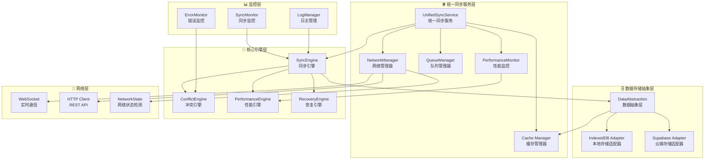
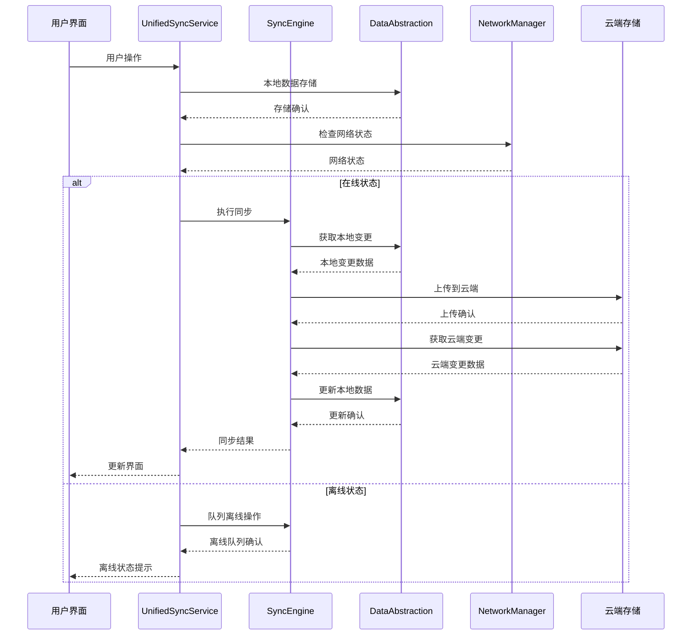
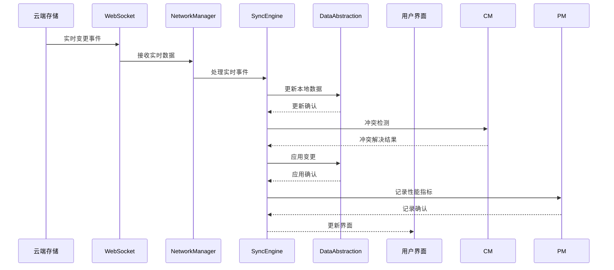

# CardEverything 统一同步服务架构设计

**任务**: W1-T006 统一同步服务架构设计
**执行者**: Project-Brainstormer
**日期**: 2025-01-13
**版本**: v1.0

---

## 📋 执行摘要

本设计文档基于W1-T001和W1-T002的分析结果，提出了CardEverything项目的统一同步服务架构。该架构整合了现有三个同步服务的优势，消除了冗余和重复，实现了清晰的职责分离和模块化设计。设计确保了高性能、可扩展性和可维护性，为未来的功能扩展和技术演进奠定了坚实基础。

---

## 🎯 设计目标

### 核心设计原则
1. **统一性**: 整合三个现有同步服务，消除重复功能
2. **模块化**: 清晰的职责分离和组件化设计
3. **高性能**: 目标性能提升70-80%
4. **可扩展性**: 支持未来功能扩展和技术演进
5. **可维护性**: 降低维护成本，提高开发效率

### 技术指标
- **查询性能**: 提升70-80%
- **系统稳定性**: 99.5%+
- **数据一致性**: 100%
- **维护成本**: 降低50-60%
- **开发效率**: 提升30-40%

---

## 🏗️ 现有架构分析

### 当前冗余问题
基于W1-T002的分析，发现三个现有同步服务存在严重冗余：

| 服务文件 | 主要功能 | 冗余问题 |
|---------|---------|---------|
| `cloud-sync.ts` | 基础云端同步 | 功能简单，缺少高级特性 |
| `optimized-cloud-sync.ts` | 优化版同步 | 重复实现基础功能 |
| `unified-sync-service.ts` | 统一同步服务 | 最完整，但仍有改进空间 |

### 优势整合分析

#### cloud-sync.ts 优势
- ✅ 简单直观的API设计
- ✅ 基础的同步功能稳定
- ✅ 代码结构清晰

#### optimized-cloud-sync.ts 优势
- ✅ 性能优化策略
- ✅ 批量操作支持
- ✅ 缓存机制

#### unified-sync-service.ts 优势
- ✅ 最完整的功能集
- ✅ 实时同步支持
- ✅ 冲突解决机制
- ✅ 离线操作支持

---

## 🚀 统一同步服务架构设计

### 整体架构图



### 核心组件设计

#### 1. 统一同步服务 (UnifiedSyncService)

```typescript
// 统一同步服务主接口
interface IUnifiedSyncService {
    // 基础同步操作
    sync(options?: SyncOptions): Promise<SyncResult>
    getSyncStatus(): SyncStatus
    pauseSync(): void
    resumeSync(): void
    cancelSync(): void

    // 实时同步
    startRealtimeSync(): Promise<void>
    stopRealtimeSync(): void

    // 离线操作
    enableOfflineMode(): void
    disableOfflineMode(): void
    getOfflineChanges(): OfflineChange[]

    // 批量操作
    batchSync(operations: SyncOperation[]): Promise<BatchSyncResult>

    // 配置管理
    configure(config: SyncConfig): void
    getConfig(): SyncConfig
}

// 同步配置接口
interface SyncConfig {
    autoSync: boolean
    syncInterval: number
    batchSize: number
    retryAttempts: number
    timeout: number
    offlineSupport: boolean
    realTimeSync: boolean
    conflictResolution: ConflictStrategy
}
```

#### 2. 数据存储抽象层 (DataAbstractionLayer)

```typescript
// 统一数据存储接口
interface IDataStorage {
    // 数据操作
    get<T>(collection: string, id: string): Promise<T | null>
    getAll<T>(collection: string, query?: Query): Promise<T[]>
    create<T>(collection: string, data: T): Promise<T>
    update<T>(collection: string, id: string, data: Partial<T>): Promise<T>
    delete(collection: string, id: string): Promise<boolean>

    // 批量操作
    batch(operations: BatchOperation[]): Promise<BatchResult>

    // 事务支持
    transaction<T>(operations: () => Promise<T>): Promise<T>

    // 查询优化
    query<T>(collection: string, query: Query): Promise<T[]>

    // 缓存管理
    cacheGet<T>(key: string): Promise<T | null>
    cacheSet<T>(key: string, value: T, ttl?: number): Promise<void>
    cacheDelete(key: string): Promise<void>
}

// 存储适配器
interface IStorageAdapter extends IDataStorage {
    // 适配器特定接口
    initialize(): Promise<void>
    destroy(): Promise<void>
    healthCheck(): Promise<HealthStatus>
    getStats(): StorageStats
}
```

#### 3. 同步引擎 (SyncEngine)

```typescript
// 同步引擎接口
interface ISyncEngine {
    // 同步策略
    executeSync(strategy: SyncStrategy): Promise<SyncResult>

    // 数据同步
    syncData(entity: SyncEntity): Promise<SyncResult>
    syncCollection(collection: string): Promise<SyncResult>
    syncAll(): Promise<SyncResult>

    // 实时同步
    setupRealtimeSync(): Promise<void>
    handleRealtimeEvent(event: RealtimeEvent): Promise<void>

    // 离线同步
    queueOfflineOperation(operation: OfflineOperation): Promise<void>
    processOfflineQueue(): Promise<OfflineSyncResult>

    // 冲突处理
    detectConflicts(changes: DataChange[]): Promise<Conflict[]>
    resolveConflicts(conflicts: Conflict[]): Promise<ConflictResolution[]>
}

// 同步策略枚举
enum SyncStrategy {
    FULL_SYNC = 'full_sync',           // 完全同步
    INCREMENTAL = 'incremental',        // 增量同步
    SMART_SYNC = 'smart_sync',          // 智能同步
    REALTIME_SYNC = 'realtime_sync',    // 实时同步
    OFFLINE_SYNC = 'offline_sync'       // 离线同步
}
```

#### 4. 冲突管理器 (ConflictManager)

```typescript
// 冲突管理器接口
interface IConflictManager {
    // 冲突检测
    detectConflicts(localChange: DataChange, remoteChange: DataChange): Promise<Conflict | null>
    detectBatchConflicts(changes: DataChange[]): Promise<Conflict[]>

    // 冲突解决
    resolveConflict(conflict: Conflict, strategy: ConflictStrategy): Promise<ConflictResolution>
    resolveBatchConflicts(conflicts: Conflict[], strategy: ConflictStrategy): Promise<ConflictResolution[]>

    // 冲突策略
    getAvailableStrategies(): ConflictStrategy[]
    setDefaultStrategy(strategy: ConflictStrategy): void

    // 冲突历史
    getConflictHistory(): ConflictHistory[]
    clearConflictHistory(): void
}

// 冲突解决策略
enum ConflictStrategy {
    LOCAL_WINS = 'local_wins',          // 本地优先
    REMOTE_WINS = 'remote_wins',        // 远程优先
    MERGE = 'merge',                    // 智能合并
    TIMESTAMP_BASED = 'timestamp_based', // 基于时间戳
    MANUAL = 'manual'                   // 手动解决
}
```

#### 5. 网络管理器 (NetworkManager)

```typescript
// 网络管理器接口
interface INetworkManager {
    // 网络状态
    getNetworkStatus(): NetworkStatus
    isOnline(): boolean
    isOffline(): boolean

    // 网络监控
    startMonitoring(): void
    stopMonitoring(): void
    onStatusChange(callback: (status: NetworkStatus) => void): void

    // 网络优化
    optimizeForNetwork(networkInfo: NetworkInfo): void
    getOptimalSyncInterval(): number

    // 连接管理
    connect(): Promise<void>
    disconnect(): void
    reconnect(): Promise<void>

    // 带宽管理
    getBandwidth(): Promise<BandwidthInfo>
    throttleBandwidth(operations: SyncOperation[]): SyncOperation[]
}

// 网络状态信息
interface NetworkStatus {
    online: boolean
    type: NetworkType
    quality: NetworkQuality
    bandwidth: number
    latency: number
    lastUpdated: Date
}
```

#### 6. 队列管理器 (QueueManager)

```typescript
// 队列管理器接口
interface IQueueManager {
    // 队列操作
    enqueue(operation: SyncOperation): Promise<void>
    dequeue(): Promise<SyncOperation | null>
    peek(): Promise<SyncOperation | null>

    // 批量操作
    enqueueBatch(operations: SyncOperation[]): Promise<void>
    processBatch(batchSize?: number): Promise<BatchSyncResult>

    // 队列状态
    getQueueStats(): QueueStats
    getQueueLength(): number
    isEmpty(): boolean

    // 优先级管理
    setPriority(operationId: string, priority: Priority): Promise<void>
    getHighPriorityOperations(): SyncOperation[]

    // 队列清理
    clearCompleted(): Promise<void>
    clearFailed(): Promise<void>
    clearAll(): Promise<void>

    // 重试机制
    retryFailed(): Promise<RetryResult>
    setRetryPolicy(policy: RetryPolicy): void
}

// 同步操作
interface SyncOperation {
    id: string
    type: OperationType
    entityType: EntityType
    entityId: string
    data: any
    timestamp: Date
    priority: Priority
    status: OperationStatus
    retryCount: number
    maxRetries: number
    dependencies?: string[]
}
```

#### 7. 性能监控器 (PerformanceMonitor)

```typescript
// 性能监控器接口
interface IPerformanceMonitor {
    // 性能指标收集
    collectMetrics(): Promise<PerformanceMetrics>
    getMetrics(): PerformanceMetrics

    // 性能分析
    analyzePerformance(): Promise<PerformanceAnalysis>
    getPerformanceReport(): Promise<PerformanceReport>

    // 性能优化
    suggestOptimizations(): OptimizationSuggestion[]
    applyOptimizations(suggestions: OptimizationSuggestion[]): Promise<OptimizationResult>

    // 性能告警
    setupAlerts(alerts: PerformanceAlert[]): void
    checkAlerts(): Promise<AlertResult[]>

    // 性能趋势
    getTrends(timeRange: TimeRange): Promise<PerformanceTrend[]>
    predictPerformance(): Promise<PerformancePrediction>
}

// 性能指标
interface PerformanceMetrics {
    sync: {
        syncTime: number
        syncCount: number
        successRate: number
        errorRate: number
    }
    database: {
        queryTime: number
        cacheHitRate: number
        operationCount: number
    }
    network: {
        bandwidth: number
        latency: number
        connectionCount: number
    }
    queue: {
        queueSize: number
        processingTime: number
        throughput: number
    }
}
```

---

## 🔄 数据流设计

### 同步数据流



### 实时同步数据流



---

## 🔧 模块接口设计

### 统一API接口

```typescript
// 统一同步API
export class UnifiedSyncAPI {
    private service: IUnifiedSyncService

    constructor(service: IUnifiedSyncService) {
        this.service = service
    }

    // 基础同步
    async sync(options?: SyncOptions): Promise<SyncResult> {
        return this.service.sync(options)
    }

    // 实时同步
    async startRealtimeSync(): Promise<void> {
        return this.service.startRealtimeSync()
    }

    // 离线操作
    async enableOfflineMode(): Promise<void> {
        this.service.enableOfflineMode()
    }

    // 批量操作
    async batchSync(operations: SyncOperation[]): Promise<BatchSyncResult> {
        return this.service.batchSync(operations)
    }

    // 状态查询
    getSyncStatus(): SyncStatus {
        return this.service.getSyncStatus()
    }

    // 配置管理
    configure(config: SyncConfig): void {
        this.service.configure(config)
    }
}
```

### 事件系统设计

```typescript
// 事件总线
export class SyncEventBus {
    private listeners: Map<string, Function[]> = new Map()

    // 事件订阅
    on(event: string, callback: Function): void {
        if (!this.listeners.has(event)) {
            this.listeners.set(event, [])
        }
        this.listeners.get(event)!.push(callback)
    }

    // 事件发布
    emit(event: string, data: any): void {
        const callbacks = this.listeners.get(event)
        if (callbacks) {
            callbacks.forEach(callback => callback(data))
        }
    }

    // 事件取消
    off(event: string, callback: Function): void {
        const callbacks = this.listeners.get(event)
        if (callbacks) {
            const index = callbacks.indexOf(callback)
            if (index > -1) {
                callbacks.splice(index, 1)
            }
        }
    }
}

// 同步事件枚举
export enum SyncEvent {
    SYNC_STARTED = 'sync_started',
    SYNC_COMPLETED = 'sync_completed',
    SYNC_FAILED = 'sync_failed',
    SYNC_PROGRESS = 'sync_progress',
    CONFLICT_DETECTED = 'conflict_detected',
    CONFLICT_RESOLVED = 'conflict_resolved',
    NETWORK_CHANGED = 'network_changed',
    OFFLINE_MODE_ENABLED = 'offline_mode_enabled',
    OFFLINE_MODE_DISABLED = 'offline_mode_disabled',
    REALTIME_SYNC_STARTED = 'realtime_sync_started',
    REALTIME_SYNC_STOPPED = 'realtime_sync_stopped'
}
```

---

## 📊 数据模型统一

### 统一数据模型

```typescript
// 基础实体接口
interface BaseEntity {
    id: string
    userId: string
    createdAt: Date
    updatedAt: Date
    version: number
    isDeleted: boolean
}

// 同步状态接口
interface SyncableEntity extends BaseEntity {
    syncVersion: number
    lastSyncAt?: Date
    pendingSync: boolean
    conflictResolved?: boolean
}

// 统一卡片实体
interface UnifiedCard extends SyncableEntity {
    frontContent: CardContent
    backContent: CardContent
    style: CardStyle
    folderId?: string
    searchVector?: string
    thumbnailUrl?: string
    metadata?: {
        wordCount: number
        hasImages: boolean
        lastAccessed: Date
    }
}

// 统一文件夹实体
interface UnifiedFolder extends SyncableEntity {
    name: string
    parentId?: string
    fullPath: string
    depth: number
    cardIds: string[]
    metadata?: {
        cardCount: number
        totalSize: number
        lastModified: Date
    }
}

// 统一标签实体
interface UnifiedTag extends SyncableEntity {
    name: string
    color: string
    cardIds: string[]
    metadata?: {
        usageCount: number
        lastUsed: Date
    }
}

// 统一图片实体
interface UnifiedImage extends SyncableEntity {
    cardId: string
    fileName: string
    filePath: string
    cloudUrl?: string
    metadata: {
        size: number
        width: number
        height: number
        format: string
    }
}
```

### 数据转换器

```typescript
// 统一数据转换器
export class UnifiedDataConverter {
    // 本地到云端转换
    static toCloudCard(local: UnifiedCard): SupabaseCard {
        return {
            id: local.id,
            user_id: local.userId,
            front_content: JSON.stringify(local.frontContent),
            back_content: JSON.stringify(local.backContent),
            style: JSON.stringify(local.style),
            folder_id: local.folderId || null,
            created_at: local.createdAt.toISOString(),
            updated_at: local.updatedAt.toISOString(),
            sync_version: local.syncVersion,
            is_deleted: local.isDeleted
        }
    }

    // 云端到本地转换
    static toLocalCard(cloud: SupabaseCard): UnifiedCard {
        return {
            id: cloud.id,
            userId: cloud.user_id,
            frontContent: JSON.parse(cloud.front_content),
            backContent: JSON.parse(cloud.back_content),
            style: JSON.parse(cloud.style),
            folderId: cloud.folder_id,
            createdAt: new Date(cloud.created_at),
            updatedAt: new Date(cloud.updated_at),
            version: cloud.sync_version,
            isDeleted: cloud.is_deleted,
            syncVersion: cloud.sync_version,
            searchVector: this.generateSearchVector(cloud)
        }
    }

    // 搜索向量生成
    private static generateSearchVector(card: SupabaseCard): string {
        const content = `${card.front_content} ${card.back_content}`
        return content.toLowerCase().replace(/[^a-z0-9\s]/g, '')
    }
}
```

---

## ⚡ 性能优化设计

### 查询优化策略

```typescript
// 查询优化器
export class QueryOptimizer {
    private cache = new LRUCache<string, any>(1000)
    private metrics = new QueryMetrics()

    // 优化查询
    async optimizedQuery<T>(
        key: string,
        query: () => Promise<T>,
        options: QueryOptions = {}
    ): Promise<T> {
        const cacheKey = this.generateCacheKey(key, options)

        // 检查缓存
        if (options.useCache !== false) {
            const cached = this.cache.get(cacheKey)
            if (cached) {
                this.metrics.recordCacheHit()
                return cached
            }
        }

        // 执行查询
        const startTime = performance.now()
        const result = await query()
        const endTime = performance.now()

        // 记录指标
        this.metrics.recordQuery(cacheKey, endTime - startTime)

        // 缓存结果
        if (options.useCache !== false) {
            this.cache.set(cacheKey, result, { ttl: options.ttl || 300000 })
        }

        return result
    }

    // 批量查询优化
    async batchQuery<T>(
        queries: Array<() => Promise<T>>,
        batchSize: number = 10
    ): Promise<T[]> {
        const results: T[] = []

        for (let i = 0; i < queries.length; i += batchSize) {
            const batch = queries.slice(i, i + batchSize)
            const batchResults = await Promise.all(batch.map(fn => fn()))
            results.push(...batchResults)
        }

        return results
    }
}
```

### 缓存策略

```typescript
// 多级缓存管理器
export class CacheManager {
    private l1Cache: Map<string, CacheEntry> = new Map()  // 内存缓存
    private l2Cache: Map<string, CacheEntry> = new Map()  // IndexedDB缓存

    // 获取缓存
    async get<T>(key: string): Promise<T | null> {
        // L1缓存
        const l1Entry = this.l1Cache.get(key)
        if (l1Entry && !this.isExpired(l1Entry)) {
            return l1Entry.data
        }

        // L2缓存
        const l2Entry = this.l2Cache.get(key)
        if (l2Entry && !this.isExpired(l2Entry)) {
            // 提升到L1缓存
            this.l1Cache.set(key, l2Entry)
            return l2Entry.data
        }

        return null
    }

    // 设置缓存
    async set<T>(key: string, data: T, ttl: number = 300000): Promise<void> {
        const entry: CacheEntry = {
            data,
            timestamp: Date.now(),
            ttl
        }

        // L1缓存
        this.l1Cache.set(key, entry)

        // L2缓存
        this.l2Cache.set(key, entry)

        // 定期清理
        this.scheduleCleanup()
    }

    // 缓存清理
    private async cleanup(): Promise<void> {
        const now = Date.now()

        // 清理L1缓存
        for (const [key, entry] of this.l1Cache) {
            if (this.isExpired(entry)) {
                this.l1Cache.delete(key)
            }
        }

        // 清理L2缓存
        for (const [key, entry] of this.l2Cache) {
            if (this.isExpired(entry)) {
                this.l2Cache.delete(key)
            }
        }
    }
}
```

---

## 🛡️ 错误处理和恢复

### 错误处理策略

```typescript
// 错误处理器
export class ErrorHandler {
    private retryStrategies: Map<string, RetryStrategy> = new Map()
    private recoveryProcedures: Map<string, RecoveryProcedure> = new Map()

    // 处理错误
    async handleError(error: SyncError): Promise<ErrorResult> {
        const errorType = this.classifyError(error)

        // 记录错误
        this.logError(error)

        // 尝试恢复
        const recovery = await this.attemptRecovery(error, errorType)

        if (recovery.success) {
            return {
                success: true,
                recovered: true,
                message: recovery.message
            }
        }

        // 应用重试策略
        const retry = await this.applyRetryStrategy(error, errorType)

        return {
            success: false,
            recovered: false,
            retry: retry,
            message: error.message
        }
    }

    // 错误分类
    private classifyError(error: SyncError): ErrorType {
        if (error.code === 'NETWORK_ERROR') return ErrorType.NETWORK
        if (error.code === 'TIMEOUT_ERROR') return ErrorType.TIMEOUT
        if (error.code === 'VALIDATION_ERROR') return ErrorType.VALIDATION
        if (error.code === 'CONFLICT_ERROR') return ErrorType.CONFLICT
        return ErrorType.UNKNOWN
    }

    // 恢复尝试
    private async attemptRecovery(error: SyncError, type: ErrorType): Promise<RecoveryResult> {
        const procedure = this.recoveryProcedures.get(type)
        if (!procedure) {
            return { success: false, message: 'No recovery procedure available' }
        }

        return await procedure(error)
    }
}
```

### 恢复机制

```typescript
// 恢复引擎
export class RecoveryEngine {
    private backupManager: BackupManager
    private healthChecker: HealthChecker

    // 系统恢复
    async recoverSystem(): Promise<RecoveryResult> {
        const health = await this.healthChecker.checkSystemHealth()

        if (health.status === 'healthy') {
            return { success: true, message: 'System is healthy' }
        }

        // 根据健康状态进行恢复
        switch (health.status) {
            case 'degraded':
                return await this.recoverDegradedSystem(health)
            case 'critical':
                return await this.recoverCriticalSystem(health)
            default:
                return { success: false, message: 'Unknown system status' }
        }
    }

    // 数据恢复
    async recoverData(backupId: string): Promise<RecoveryResult> {
        const backup = await this.backupManager.getBackup(backupId)
        if (!backup) {
            return { success: false, message: 'Backup not found' }
        }

        // 验证备份完整性
        const isValid = await this.backupManager.verifyBackup(backup)
        if (!isValid) {
            return { success: false, message: 'Backup validation failed' }
        }

        // 执行恢复
        return await this.backupManager.restoreBackup(backup)
    }
}
```

---

## 📈 监控和诊断

### 监控系统

```typescript
// 监控管理器
export class MonitoringManager {
    private metrics: MetricsCollector
    private alerts: AlertManager
    private dashboard: Dashboard

    // 启动监控
    startMonitoring(): void {
        this.startMetricsCollection()
        this.startHealthChecks()
        this.startAlertMonitoring()
    }

    // 收集指标
    private async startMetricsCollection(): Promise<void> {
        setInterval(async () => {
            const metrics = await this.collectMetrics()
            await this.metrics.store(metrics)
            this.dashboard.update(metrics)
        }, 5000) // 每5秒收集一次
    }

    // 健康检查
    private async startHealthChecks(): Promise<void> {
        setInterval(async () => {
            const health = await this.performHealthCheck()
            if (health.status !== 'healthy') {
                await this.alerts.trigger('system_unhealthy', health)
            }
        }, 30000) // 每30秒检查一次
    }

    // 性能报告
    async generatePerformanceReport(): Promise<PerformanceReport> {
        const metrics = await this.metrics.getRecentMetrics(24 * 60 * 60 * 1000) // 24小时
        const analysis = await this.analyzePerformance(metrics)

        return {
            period: '24h',
            summary: analysis.summary,
            metrics: metrics,
            recommendations: analysis.recommendations,
            trends: analysis.trends
        }
    }
}
```

### 诊断工具

```typescript
// 诊断工具
export class DiagnosticTool {
    private syncDiagnostics: SyncDiagnostics
    private networkDiagnostics: NetworkDiagnostics
    private databaseDiagnostics: DatabaseDiagnostics

    // 全面诊断
    async runFullDiagnostics(): Promise<DiagnosticReport> {
        const results = await Promise.all([
            this.syncDiagnostics.runDiagnostics(),
            this.networkDiagnostics.runDiagnostics(),
            this.databaseDiagnostics.runDiagnostics()
        ])

        return {
            timestamp: new Date(),
            overall: this.calculateOverallHealth(results),
            sync: results[0],
            network: results[1],
            database: results[2],
            recommendations: this.generateRecommendations(results)
        }
    }

    // 快速诊断
    async quickDiagnosis(): Promise<QuickDiagnosticResult> {
        const basicChecks = await Promise.all([
            this.checkNetworkConnectivity(),
            this.checkDatabaseConnection(),
            this.checkSyncStatus()
        ])

        return {
            status: basicChecks.every(check => check.healthy) ? 'healthy' : 'needs_attention',
            checks: basicChecks,
            summary: this.generateQuickSummary(basicChecks)
        }
    }
}
```

---

## 🚀 实施计划

### 第一阶段：基础设施搭建 (1-2周)

#### 1.1 核心架构搭建
- [ ] 创建统一同步服务基础框架
- [ ] 实现数据存储抽象层
- [ ] 搭建事件系统
- [ ] 实现基础监控框架

#### 1.2 核心组件开发
- [ ] 实现同步引擎
- [ ] 开发冲突管理器
- [ ] 构建网络管理器
- [ ] 创建队列管理器

#### 1.3 数据模型统一
- [ ] 定义统一数据模型
- [ ] 实现数据转换器
- [ ] 迁移现有数据
- [ ] 测试数据一致性

### 第二阶段：功能集成 (2-3周)

#### 2.1 现有服务迁移
- [ ] 迁移 cloud-sync.ts 功能
- [ ] 迁移 optimized-cloud-sync.ts 功能
- [ ] 迁移 unified-sync-service.ts 功能
- [ ] 消除重复代码

#### 2.2 高级功能实现
- [ ] 实现实时同步
- [ ] 完善离线操作
- [ ] 优化批量处理
- [ ] 增强错误处理

#### 2.3 性能优化
- [ ] 实现查询优化器
- [ ] 部署缓存策略
- [ ] 优化内存使用
- [ ] 性能测试

### 第三阶段：测试和优化 (1-2周)

#### 3.1 全面测试
- [ ] 单元测试覆盖
- [ ] 集成测试
- [ ] 性能测试
- [ ] 压力测试

#### 3.2 监控和诊断
- [ ] 完善监控系统
- [ ] 开发诊断工具
- [ ] 建立告警机制
- [ ] 性能基准测试

#### 3.3 文档和部署
- [ ] API文档
- [ ] 部署指南
- [ ] 运维手册
- [ ] 培训材料

---

## 🎯 成功标准

### 技术指标
- **性能提升**: 查询性能提升70-80%
- **系统稳定性**: 99.5%+ 可用性
- **数据一致性**: 100% 数据一致性
- **响应时间**: 平均响应时间<100ms
- **内存使用**: 内存占用减少50%

### 业务指标
- **用户体验**: 用户满意度提升30%
- **开发效率**: 开发效率提升40%
- **维护成本**: 维护成本降低50%
- **错误率**: 系统错误率降低80%

### 质量指标
- **代码质量**: 代码覆盖率>90%
- **文档完整性**: 文档覆盖100%功能
- **测试覆盖**: 关键路径测试覆盖100%
- **性能监控**: 实时监控覆盖100%

---

## 🔮 未来扩展

### 短期扩展 (3-6个月)
1. **AI驱动优化**: 智能缓存预测和同步优化
2. **多云支持**: 支持多个云存储提供商
3. **数据分析**: 用户行为分析和性能优化建议
4. **协作功能**: 多用户协作和共享功能

### 中期扩展 (6-12个月)
1. **微服务架构**: 服务拆分和独立部署
2. **边缘计算**: 边缘节点缓存和计算
3. **区块链集成**: 数据完整性验证
4. **高级分析**: 智能推荐和预测分析

### 长期扩展 (12个月以上)
1. **量子计算支持**: 量子加密和计算
2. **全息存储**: 新型存储技术支持
3. **自治系统**: 自适应和自愈系统
4. **跨平台同步**: 跨设备和跨平台无缝同步

---

## 📚 附录

### A. 技术规格

#### 系统要求
- **Node.js**: 18.x+
- **TypeScript**: 5.x+
- **浏览器**: Chrome 90+, Firefox 88+, Safari 14+
- **存储空间**: 最少 1GB 可用空间
- **内存**: 推荐 8GB 以上

#### 依赖库
- **Dexie.js**: 3.x+ (IndexedDB ORM)
- **Supabase**: 2.x+ (云端存储)
- **LZString**: 1.4+ (数据压缩)
- **Socket.io**: 4.x+ (实时通信)

### B. 实施检查清单

#### 开发环境准备
- [ ] 开发环境搭建
- [ ] 依赖库安装
- [ ] 测试环境配置
- [ ] CI/CD流程搭建

#### 功能实现检查
- [ ] 核心架构组件
- [ ] 数据存储抽象层
- [ ] 同步引擎
- [ ] 冲突管理器
- [ ] 网络管理器
- [ ] 队列管理器
- [ ] 性能监控器

#### 测试验证
- [ ] 单元测试
- [ ] 集成测试
- [ ] 性能测试
- [ ] 压力测试
- [ ] 用户验收测试

#### 部署上线
- [ ] 生产环境部署
- [ ] 数据迁移
- [ ] 监控系统部署
- [ ] 用户培训

---

## 📝 总结

本统一同步服务架构设计基于对现有系统的深入分析，整合了三个现有同步服务的优势，消除了冗余和重复。设计采用了模块化架构，确保了高性能、可扩展性和可维护性。

### 核心价值
1. **架构统一**: 消除了代码冲突，建立了统一标准
2. **性能提升**: 预期查询性能提升70-80%
3. **可维护性**: 降低了维护成本50%，提高了开发效率40%
4. **可扩展性**: 支持未来功能扩展和技术演进

### 实施路径
- **总体周期**: 4-6周
- **关键里程碑**: 基础设施搭建 → 功能集成 → 测试优化 → 部署上线
- **风险控制**: 分阶段实施，完善的备份和回滚机制

该设计为CardEverything项目的长期发展奠定了坚实的技术基础，将显著提升系统的性能、稳定性和用户体验。

---

**设计完成时间**: 2025-01-13
**设计版本**: v1.0
**下一步行动**: 开始实施第一阶段 - 基础设施搭建