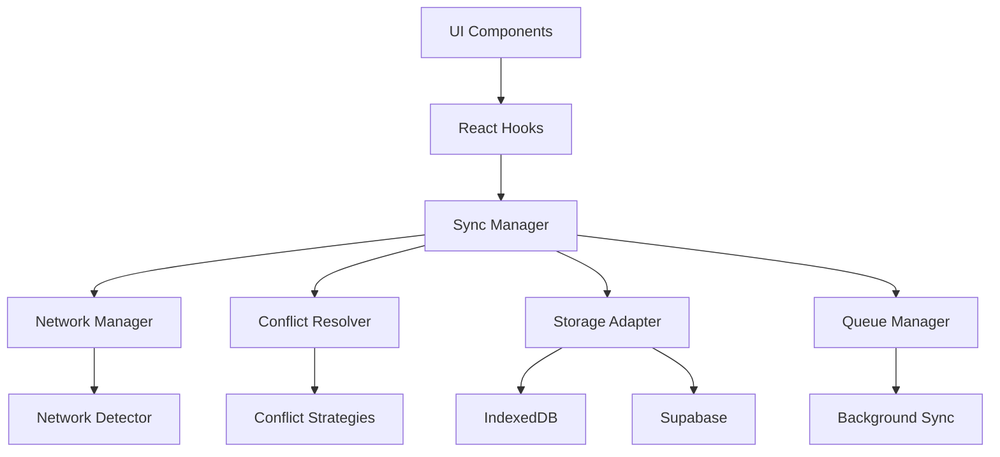

# Design Document

## Overview

This document outlines the technical design for fixing the cloud synchronization functionality in the CardEverything project. The design focuses on simplifying the existing sync architecture, implementing missing core services, and ensuring reliable multi-device synchronization with proper error handling and recovery mechanisms.

## Steering Document Alignment

### Technical Standards (tech.md)
The design follows the project's established patterns:
- **Service-first architecture**: Using services for business logic separation
- **Hook-based data access**: Leveraging React hooks for data management
- **TypeScript throughout**: Maintaining type safety across the application
- **Modular component structure**: Following the established component organization

### Project Structure (structure.md)
The implementation will maintain the existing project structure while adding necessary services:
- **Services**: Adding missing core services in the `src/services/` directory
- **Hooks**: Extending existing hooks for better sync integration
- **Components**: Minimizing component changes to prevent breaking existing functionality
- **Utilities**: Adding sync-specific utilities where needed

## Code Reuse Analysis

### Existing Components to Leverage
- **unified-sync-service.ts**: Core sync logic will be refactored and simplified
- **sync-queue.ts**: Existing queue mechanism will be enhanced with better error handling
- **universal-storage-adapter.ts**: Storage abstraction will be leveraged for consistent data access
- **auth.ts**: Authentication system will be integrated with sync services
- **database.ts**: Existing database schema and operations will be maintained
- **realtime connection manager**: Existing Realtime infrastructure will be stabilized

### Integration Points
- **Supabase Integration**: Replace placeholder configuration with actual Supabase project settings
- **IndexedDB**: Maintain existing IndexedDB usage for offline capabilities
- **React Hooks**: Integrate sync status with existing data hooks
- **Error Boundaries**: Leverage existing error handling mechanisms

## Architecture

The revised sync architecture will follow a simplified, layered approach:



### Modular Design Principles
- **Single File Responsibility**: Each service handles one specific concern (network, conflicts, queuing)
- **Component Isolation**: Create small, focused services rather than large monolithic files
- **Service Layer Separation**: Separate data access, business logic, and presentation layers
- **Utility Modularity**: Break sync utilities into focused, single-purpose modules

## Components and Interfaces

### Sync Manager (New Core Service)
- **Purpose:** Centralized coordination of all sync operations
- **Interfaces:** 
  - `syncNow(): Promise<void>`
  - `getSyncStatus(): SyncStatus`
  - `registerSyncListener(callback: Function): void`
- **Dependencies:** Network Manager, Conflict Resolver, Queue Manager
- **Reuses:** Existing unified-sync-service.ts logic

### Network Manager (New Service)
- **Purpose:** Monitor network connectivity and handle online/offline transitions
- **Interfaces:**
  - `isOnline(): boolean`
  - `onStatusChange(callback: Function): void`
  - `retryFailedOperations(): Promise<void>`
- **Dependencies:** Browser Network Information API
- **Reuses:** None (new implementation)

### Conflict Resolver (New Service)
- **Purpose:** Intelligently resolve sync conflicts between local and remote data
- **Interfaces:**
  - `resolveConflict(local: any, remote: any): Promise<any>`
  - `setResolutionStrategy(strategy: ConflictStrategy): void`
- **Dependencies:** Timestamp comparison, user preference storage
- **Reuses:** Existing conflict resolution logic from sync-queue.ts

### Background Sync Service (New Service)
- **Purpose:** Handle sync operations when app is in background
- **Interfaces:**
  - `startBackgroundSync(): void`
  - `stopBackgroundSync(): void`
  - `scheduleSync(interval: number): void`
- **Dependencies:** Service Worker API, Background Sync API
- **Reuses:** Existing sync logic adapted for background execution

### Enhanced Queue Manager (Refactor Existing)
- **Purpose:** Manage sync operation queue with retry logic and persistence
- **Interfaces:**
  - `enqueue(operation: SyncOperation): Promise<void>`
  - `processQueue(): Promise<void>`
  - `clearQueue(): Promise<void>`
- **Dependencies:** Local storage for queue persistence
- **Reuses:** Existing sync-queue.ts with enhanced error handling

## Data Models

### SyncStatus
```
interface SyncStatus {
  isSyncing: boolean;
  lastSync: Date | null;
  pendingOperations: number;
  errors: SyncError[];
  networkStatus: 'online' | 'offline' | 'connecting';
}
```

### SyncOperation
```
interface SyncOperation {
  id: string;
  type: 'create' | 'update' | 'delete';
  entityType: 'card' | 'folder' | 'tag';
  data: any;
  timestamp: Date;
  retryCount: number;
  status: 'pending' | 'processing' | 'completed' | 'failed';
}
```

### ConflictResolution
```
interface ConflictResolution {
  strategy: 'timestamp' | 'manual' | 'local-wins' | 'remote-wins';
  autoResolve: boolean;
  lastResolved: Date;
  resolutionLog: ConflictResolutionEntry[];
}
```

## Error Handling

### Error Scenarios
1. **Network Connectivity Loss**
   - **Handling:** Queue operations, auto-retry with exponential backoff
   - **User Impact:** Show offline indicator, sync when connection restored

2. **Authentication Failure**
   - **Handling:** Redirect to login, preserve unsynced changes
   - **User Impact:** Login prompt with data preservation guarantee

3. **Data Conflict Detection**
   - **Handling:** Automatic resolution based on timestamps, manual fallback
   - **User Impact:** Conflict resolution dialog if automatic resolution fails

4. **Service Unavailable**
   - **Handling:** Graceful degradation to offline mode, retry when available
   - **User Impact:** Inform user of limited functionality, preserve data

5. **Data Corruption**
   - **Handling:** Restore from backup, validate data integrity
   - **User Impact:** Inform user of recovery process, minimize data loss

## Testing Strategy

### Unit Testing
- **Sync Manager**: Test sync coordination and status reporting
- **Network Manager**: Test network detection and retry logic
- **Conflict Resolver**: Test conflict resolution strategies
- **Queue Manager**: Test operation queuing and processing
- **Background Sync**: Test background sync scheduling

### Integration Testing
- **End-to-End Sync**: Test data flow from UI to cloud and back
- **Offline to Online**: Test behavior when transitioning between connectivity states
- **Multi-device Simulation**: Test sync across multiple browser instances
- **Error Recovery**: Test recovery from various failure scenarios

### End-to-End Testing
- **User Workflow**: Test complete user workflows with sync
- **Performance Testing**: Test sync performance with large datasets
- **Stress Testing**: Test system behavior under high load
- **Compatibility Testing**: Test across different browsers and devices

## Implementation Strategy

### Phase 1: Core Infrastructure
1. Create Network Manager service
2. Create Conflict Resolver service
3. Refactor existing Sync Manager to use new services

### Phase 2: Enhanced Queue and Background
1. Enhance Queue Manager with retry logic
2. Create Background Sync service
3. Integrate with existing sync infrastructure

### Phase 3: Configuration and Integration
1. Replace Supabase placeholder configuration
2. Integrate with authentication system
3. Add comprehensive error handling

### Phase 4: Testing and Optimization
1. Implement comprehensive test suite
2. Performance optimization
3. User experience refinement