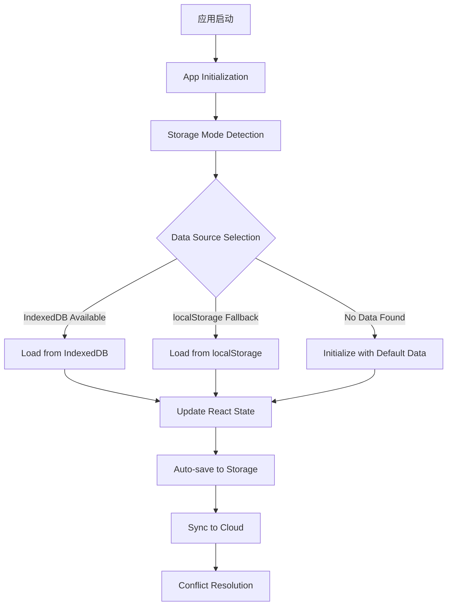

# Design Document - 数据持久性修复方案

## Overview

本文档详细说明了解决卡片应用数据持久性 bug 的修复方案。该问题的核心表现是：每次刷新页面后，应用显示默认的两张卡片，用户之前所做的所有修改都会丢失。

经过深入的系统分析，我们识别出了多个根本原因，包括应用程序初始化缺失、存储适配器方法缺失、数据源选择逻辑错误等问题。本设计方案提供了分层的修复策略，确保数据在各种场景下都能正确持久化。

## Steering Document Alignment

### Technical Standards (tech.md)
- 遵循现有的 TypeScript/React 技术栈模式
- 使用现有的服务层架构（auth, database, sync services）
- 保持现有的错误处理模式和日志记录标准
- 遵循现有的文件命名和目录结构约定

### Project Structure (structure.md)
- 保持现有的 `src/services/`, `src/hooks/`, `src/utils/` 目录结构
- 新增的组件和服务将遵循现有的模块化组织方式
- 修复工作将集中在现有文件中，避免创建新的顶层目录

## Code Reuse Analysis

### Existing Components to Leverage
- **`auth.ts`**: 用户认证状态管理，用于数据权限验证
- **`database.ts`**: IndexedDB 数据库操作，提供数据持久化基础
- **`unified-sync-service.ts`**: 云同步服务，处理数据同步逻辑
- **`universal-storage-adapter.ts`**: 存储适配器，需要扩展和修复
- **`app-init.ts`**: 应用初始化服务，需要被正确调用
- **`use-cards.ts`**: 卡片管理钩子，需要优化数据加载逻辑

### Integration Points
- **IndexedDB 数据存储**: 作为主要的数据持久化存储
- **localStorage 备份存储**: 作为兼容性存储和临时缓存
- **Supabase 云同步**: 提供跨设备数据同步能力
- **React 状态管理**: 通过 hooks 管理前端数据状态

## Architecture

### 整体架构设计

修复方案采用分层架构，确保数据流的正确性和可靠性：



### 模块化设计原则

1. **单一职责原则**: 每个服务和组件负责特定的功能域
2. **依赖注入**: 通过接口而非具体实现进行组件间通信
3. **错误隔离**: 各层错误处理独立，避免级联失败
4. **数据完整性**: 确保数据在任何操作后都保持一致性

## Components and Interfaces

### 1. Application Initializer
- **Purpose**: 确保应用启动时正确初始化所有服务
- **Location**: `src/main.tsx` (修改)
- **Interfaces**: 
  ```typescript
  interface AppInitializer {
    initialize(): Promise<void>
    healthCheck(): Promise<HealthStatus>
  }
  ```
- **Dependencies**: `appInitService`, `database`, `authService`
- **Reuses**: 现有的 `appInit.ts` 服务

### 2. Universal Storage Adapter Enhancement
- **Purpose**: 修复存储适配器的数据检测和选择逻辑
- **Location**: `src/services/universal-storage-adapter.ts` (扩展)
- **Interfaces**:
  ```typescript
  interface EnhancedStorageAdapter {
    isIndexedDBAvailable(): Promise<boolean>
    hasIndexedDBData(): Promise<boolean>
    hasLocalStorageData(): Promise<boolean>
    getOptimalStorageMode(): Promise<'localStorage' | 'indexeddb'>
  }
  ```
- **Dependencies**: `secureStorage`, `database`
- **Reuses**: 现有的存储操作方法

### 3. Data Source Selection Strategy
- **Purpose**: 智能选择最佳的数据源，避免数据丢失
- **Location**: `src/hooks/use-cards-adapter.ts` (修改)
- **Interfaces**:
  ```typescript
  interface DataSourceSelector {
    selectDataSource(): Promise<SelectedDataSource>
    validateDataIntegrity(data: any): Promise<boolean>
    fallbackStrategy(): Promise<any>
  }
  ```
- **Dependencies**: `UniversalStorageAdapter`, `database`
- **Reuses**: 现有的适配器逻辑

### 4. Enhanced Error Handling System
- **Purpose**: 提供细粒度的错误处理，避免不必要的 mock 数据回退
- **Location**: `src/hooks/use-cards.ts` (修改)
- **Interfaces**:
  ```typescript
  interface ErrorHandler {
    classifyError(error: Error): ErrorType
    handleStorageError(error: Error, context: string): Promise<any>
    recoverFromError(errorType: ErrorType): Promise<boolean>
  }
  ```
- **Dependencies**: 现有的错误处理机制
- **Reuses**: `mockCards` (仅作为最后手段)

### 5. Data Migration Service
- **Purpose**: 确保数据在不同存储系统间正确迁移
- **Location**: `src/services/universal-storage-adapter.ts` (扩展)
- **Interfaces**:
  ```typescript
  interface DataMigrationService {
    migrateFromLocalStorage(): Promise<MigrationResult>
    validateMigration(): Promise<boolean>
    rollbackMigration(): Promise<boolean>
  }
  ```
- **Dependencies**: `secureStorage`, `database`
- **Reuses**: 现有的迁移逻辑

## Data Models

### Storage Mode State
```typescript
interface StorageModeState {
  mode: 'localStorage' | 'indexeddb'
  isReady: boolean
  lastModeSwitch: Date | null
  migrationHistory: MigrationResult[]
}
```

### Data Source Selection Result
```typescript
interface SelectedDataSource {
  source: 'indexeddb' | 'localStorage' | 'default'
  data: any[] | null
  integrity: 'valid' | 'corrupted' | 'empty'
  fallbackAvailable: boolean
}
```

### Error Classification
```typescript
enum ErrorType {
  STORAGE_ACCESS_ERROR = 'storage_access',
  NETWORK_ERROR = 'network',
  DATA_CORRUPTION = 'data_corruption',
  INITIALIZATION_ERROR = 'initialization',
  PERMISSION_ERROR = 'permission'
}

interface ErrorContext {
  type: ErrorType
  severity: 'low' | 'medium' | 'high' | 'critical'
  recoverable: boolean
  userMessage: string
  technicalDetails: any
}
```

## Error Handling

### Error Scenarios

#### 1. IndexedDB 访问失败
- **Scenario**: 浏览器禁用 IndexedDB 或存储配额不足
- **Handling**: 
  - 自动降级到 localStorage
  - 显示友好的用户提示
  - 记录详细的技术日志
- **User Impact**: 功能正常，但性能可能降低

#### 2. 数据完整性验证失败
- **Scenario**: 存储的数据结构损坏或版本不兼容
- **Handling**:
  - 尝试从备份恢复
  - 使用数据修复算法
  - 仅在无法修复时使用默认数据
- **User Impact**: 可能丢失最近的修改，但历史数据得到保护

#### 3. 网络同步失败
- **Scenario**: 云同步过程中网络连接中断
- **Handling**:
  - 本地数据继续可用
  - 自动重试机制
  - 冲突解决策略
- **User Impact**: 本地操作正常，跨设备同步可能延迟

#### 4. 权限不足
- **Scenario**: 浏览器存储权限被拒绝
- **Handling**:
  - 引导用户授予权限
  - 提供替代存储方案
  - 优雅的功能降级
- **User Impact**: 需要用户交互，但应用仍然可用

## Testing Strategy

### Unit Testing

#### Storage Adapter Tests
- 测试 `isIndexedDBAvailable()` 在不同浏览器环境下的行为
- 测试 `hasIndexedDBData()` 的准确性
- 测试数据源选择逻辑的各种场景

#### Error Handler Tests
- 测试错误分类的准确性
- 测试不同错误类型的恢复策略
- 测试 mock 数据回退的触发条件

#### Migration Service Tests
- 测试 localStorage 到 IndexedDB 的数据迁移
- 测试迁移失败时的回滚机制
- 测试数据完整性验证

### Integration Testing

#### Data Flow Integration
- 测试从应用启动到数据显示的完整流程
- 测试存储模式切换时的数据一致性
- 测试错误情况下的数据恢复流程

#### Service Integration
- 测试认证服务与数据存储的集成
- 测试同步服务与本地存储的协调
- 测试初始化服务的启动顺序

### End-to-End Testing

#### User Scenarios
1. **首次访问**: 验证默认数据的正确显示
2. **数据修改**: 验证修改后的数据能正确保存
3. **页面刷新**: 验证刷新后数据仍然存在
4. **存储模式切换**: 验证不同存储模式间的数据迁移
5. **错误恢复**: 验证各种错误情况下的数据保护

#### Cross-Browser Testing
- Chrome/Edge/Safari/Firefox 的兼容性测试
- 不同浏览器的存储权限测试
- 移动端浏览器的数据持久化测试

## Implementation Priority

### Phase 1 (Critical - P0)
1. 修复应用初始化缺失问题
2. 实现 UniversalStorageAdapter 缺失方法
3. 修复数据源选择逻辑

### Phase 2 (High - P1)  
4. 优化错误处理机制
5. 改进 mock 数据回退策略

### Phase 3 (Medium - P2)
6. 完善数据迁移服务
7. 添加数据恢复功能
8. 增强监控和日志

## Risk Assessment

### High Risk Areas
- **数据丢失风险**: 在修复过程中可能进一步破坏现有数据
- **向后兼容性**: 修复可能影响现有用户的存储数据
- **性能影响**: 新的检测逻辑可能影响应用启动性能

### Mitigation Strategies
- 实施完整的数据备份机制
- 提供回滚方案
- 逐步部署和监控
- A/B 测试验证修复效果

## Success Criteria

### Technical Metrics
- 应用启动时能正确读取持久化数据 (100%)
- 页面刷新后用户数据保持不变 (100%)
- 错误恢复成功率 > 95%
- 存储模式切换成功率为 100%

### User Experience Metrics
- 用户数据丢失报告为零
- 应用启动时间增加 < 500ms
- 错误提示用户满意度 > 90%

## 小步子开发原则

### 开发策略

为了确保修复过程的稳定性和可控性，我们将严格遵循小步子开发原则：

#### 1. **增量式修改**
- **单文件修改**: 每次只修改一个文件
- **小功能块**: 每次只实现一个小功能点
- **即时验证**: 每次修改后立即验证语法和功能正确性

#### 2. **验证流程**
每个小步骤完成后，执行以下验证：
```typescript
// 1. 语法检查
npm run typecheck
npm run lint

// 2. 功能验证
npm run dev  # 启动开发服务器
// 手动测试当前修改的功能点

// 3. 错误检查
// 检查控制台错误
// 检查网络请求错误
// 检查存储访问错误
```

#### 3. **渐进式测试**
- **单元测试**: 每个新方法都添加对应的单元测试
- **集成测试**: 每完成一个组件就进行集成测试
- **端到端测试**: 每完成一个阶段就进行完整的用户流程测试

## 智能体协作开发方案

### 可用智能体分析

根据系统分析，我们可以使用以下智能体进行协作开发：

#### 1. **Database-Architect（数据库架构师）**
- **专长**: IndexedDB 和 Supabase 数据模型设计、查询优化、数据迁移
- **负责**: 数据库架构优化、存储适配器实现、数据迁移服务

#### 2. **Project-Brainstormer（项目头脑风暴师）**
- **专长**: 项目规划、任务协调、方案分析
- **负责**: 项目协调、任务分配、进度跟踪

#### 3. **Debug-Specialist（调试专家）**
- **专长**: 错误诊断、问题定位、性能优化
- **负责**: 错误处理、性能监控、问题修复

### 智能体任务分配

#### **Phase 1: 紧急修复（并行开发）**
- **Database-Architect**:
  - 任务 1.1: 修复 `universal-storage-adapter.ts` 缺失方法
  - 任务 1.2: 优化数据源选择逻辑
  - 任务 1.3: 实现数据完整性验证

- **Project-Brainstormer**:
  - 任务 1.4: 协调开发进度和任务分配
  - 任务 1.5: 制定详细的测试计划

- **Debug-Specialist**:
  - 任务 1.6: 修复 `main.tsx` 应用初始化问题
  - 任务 1.7: 优化错误处理机制

#### **Phase 2: 功能增强（顺序开发）**
- **Database-Architect**:
  - 任务 2.1: 完善数据迁移服务
  - 任务 2.2: 优化存储性能

- **Debug-Specialist**:
  - 任务 2.3: 改进错误恢复策略
  - 任务 2.4: 添加性能监控

#### **Phase 3: 质量保证（并行开发）**
- **Project-Brainstormer**:
  - 任务 3.1: 制定最终测试方案
  - 任务 3.2: 协调发布计划

- **Debug-Specialist**:
  - 任务 3.3: 执行全面测试
  - 任务 3.4: 性能优化验证

### 协作机制

#### 1. **同步策略**
- **每日同步**: 每个智能体每天汇报进度和遇到的问题
- **即时沟通**: 发现问题立即通知相关智能体
- **冲突解决**: Project-Brainstormer 负责解决任务冲突

#### 2. **质量保证**
- **交叉验证**: 每个智能体的工作由其他智能体验证
- **集成测试**: 定期进行系统集成测试
- **用户验收**: 每个阶段完成后进行用户场景测试

#### 3. **工具协作**
- **Filesystem MCP**: 所有智能体都可以使用文件系统工具
- **Supabase MCP**: Database-Architect 主要使用
- **GitHub MCP**: Project-Brainstormer 主要用于版本控制

### 并行开发策略

#### **可并行任务**
1. **文件修改**: 不同智能体可以修改不同文件
2. **测试编写**: 可以同时编写不同模块的测试
3. **文档编写**: 可以同时编写技术文档和用户文档

#### **顺序依赖任务**
1. **核心修复**: 必须先完成核心修复才能进行功能增强
2. **集成测试**: 必须在所有组件完成后进行
3. **性能优化**: 必须在功能稳定后进行

### 风险控制

#### 1. **任务冲突避免**
- **文件锁定**: 修改文件前声明，避免多人同时修改
- **接口定义**: 明确定义各模块间的接口
- **版本控制**: 使用分支管理，避免主分支不稳定

#### 2. **质量保证**
- **代码审查**: 每个智能体的代码都经过其他智能体审查
- **自动化测试**: 建立完整的自动化测试体系
- **回滚机制**: 每个阶段都有完整的回滚方案

这个增强后的设计方案结合了小步子开发原则和智能体协作策略，确保修复过程的稳定性和高效性，同时提供了详细的任务分配和协作机制。