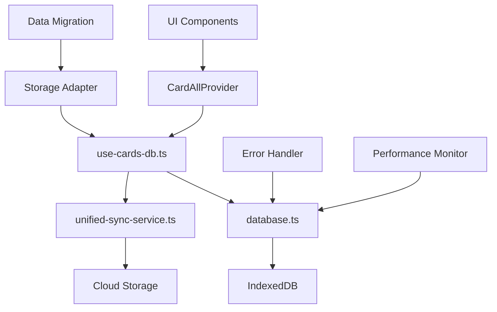

# Design Document

## Overview

本设计文档定义了CardEverything项目从localStorage迁移到IndexedDB的完整技术方案。通过利用项目现有的完整IndexedDB架构，实现用户数据的真正持久化存储，解决当前每次刷新页面都会丢失数据的核心问题。

## Steering Document Alignment

### Technical Standards (tech.md)
**技术标准遵循**：
- **数据库架构**：利用现有的Dexie.js + TypeScript架构模式
- **服务层设计**：遵循单例模式和依赖注入原则
- **Hook设计**：使用React hooks模式提供状态管理
- **错误处理**：采用统一的错误边界和异常处理机制

### Project Structure (structure.md)
**项目结构遵循**：
- **服务层**：`src/services/` 目录下统一管理数据访问服务
- **Hooks层**：`src/hooks/` 目录下提供状态管理接口
- **组件层**：`src/components/` 目录下按功能模块组织
- **类型定义**：`src/types/` 目录下统一定义数据模型

## Code Reuse Analysis

### Existing Components to Leverage
- **`use-cards-db.ts`**: 完整的IndexedDB hooks实现，将被用于替换现有的`use-cards.ts`
- **`database.ts`**: 完整的数据库服务层，支持版本管理和数据迁移
- **`unified-sync.service.ts`**: 云同步服务，支持离线操作和冲突解决
- **`secure-storage.ts`**: 安全存储服务，提供数据加密和验证

### Integration Points
- **现有UI组件**：36个组件通过hook引用替换进行集成
- **数据转换层**：利用现有的`convertToDbCard`和`convertFromDbCard`函数
- **同步队列**：集成现有的SyncQueueManager进行离线操作管理
- **状态管理**：保持现有的dispatch模式，仅更换数据源

## Architecture

### 整体架构设计
```
前端组件 → CardAllProvider → use-cards-db.ts → database.ts → IndexedDB
                                    ↓
                              unified-sync-service → 云同步
```

### Modular Design Principles
- **Single File Responsibility**: 每个文件专注单一职责（数据库服务、hooks、组件）
- **Component Isolation**: 创建小而专注的组件，避免大型单体文件
- **Service Layer Separation**: 分离数据访问、业务逻辑和展示层
- **Utility Modularity**: 将工具函数分解为专注、单一用途的模块



## Components and Interfaces

### Storage Adapter Component
- **Purpose:** 提供统一的存储接口，支持localStorage和IndexedDB的渐进式迁移
- **Interfaces:** 
  ```typescript
  interface StorageAdapter {
    migrateFromLocalStorage(): Promise<boolean>
    getCards(): Promise<Card[]>
    saveCards(cards: Card[]): Promise<void>
    setStorageMode(mode: 'localStorage' | 'indexeddb'): void
    getStorageMode(): 'localStorage' | 'indexeddb'
  }
  ```
- **Dependencies:** `database.ts`, `secure-storage.ts`
- **Reuses:** 现有的数据转换函数和验证机制

### Data Migration Service
- **Purpose:** 处理localStorage到IndexedDB的安全数据迁移
- **Interfaces:**
  ```typescript
  interface DataMigrationService {
    backupLocalStorage(): Promise<string>
    migrateData(): Promise<MigrationResult>
    validateMigration(): Promise<boolean>
    rollbackMigration(): Promise<void>
  }
  ```
- **Dependencies:** `StorageAdapter`, `database.ts`
- **Reuses:** 现有的数据转换和验证工具

### Performance Monitor
- **Purpose:** 监控数据库性能和健康状态
- **Interfaces:**
  ```typescript
  interface PerformanceMonitor {
    trackOperation(operation: string, duration: number): void
    getMetrics(): PerformanceMetrics
    checkHealth(): Promise<HealthStatus>
  }
  ```
- **Dependencies:** `database.ts`
- **Reuses:** 现有的健康检查机制

## Data Models

### Card Data Model (IndexedDB版本)
```typescript
interface DbCard {
  id: string
  title: string
  content: string
  category: string
  tags: string[]
  priority: 'low' | 'medium' | 'high'
  createdAt: string
  updatedAt: string
  userId?: string
  syncVersion: number
  pendingSync: boolean
  isDeleted: boolean
}
```

### Migration Result Model
```typescript
interface MigrationResult {
  success: boolean
  migratedCount: number
  failedItems: string[]
  duration: number
  backupPath: string
}
```

### Performance Metrics Model
```typescript
interface PerformanceMetrics {
  averageResponseTime: number
  operationCount: number
  errorRate: number
  databaseSize: number
  lastOptimization: string
}
```

## Error Handling

### Error Scenarios

1. **数据迁移失败**
   - **Handling:** 自动回滚到原始数据，记录详细错误日志，提供用户友好的重试选项
   - **User Impact:** 显示迁移失败提示，保持原有功能可用

2. **数据库操作失败**
   - **Handling:** 重试机制、错误边界捕获、优雅降级到localStorage
   - **User Impact:** 显示操作失败提示，提供离线模式选项

3. **网络同步失败**
   - **Handling:** 本地队列管理、自动重连、冲突检测和解决
   - **User Impact:** 显示同步状态，保持本地操作正常

4. **性能问题**
   - **Handling:** 自动优化、批量操作、缓存策略调整
   - **User Impact:** 显示性能提示，提供优化建议

## Testing Strategy

### Unit Testing
- **覆盖目标**: 核心服务代码 > 90% 覆盖率
- **测试重点**: 
  - StorageAdapter的所有公共方法
  - DataMigrationService的迁移逻辑
  - PerformanceMonitor的指标收集
  - 错误处理机制

### Integration Testing
- **测试重点**: 
  - 完整的数据迁移流程
  - IndexedDB与云同步的集成
  - 错误场景的恢复机制
  - 性能基准验证

### End-to-End Testing
- **用户场景**: 
  - 首次启动的数据迁移
  - 日常卡片CRUD操作
  - 离线操作和重新同步
  - 数据完整性和一致性验证

### Performance Testing
- **测试指标**: 
  - 数据库操作响应时间 (< 100ms)
  - 数据迁移成功率 (> 99.9%)
  - 并发用户操作稳定性
  - 大数据量下的性能表现