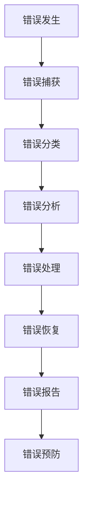
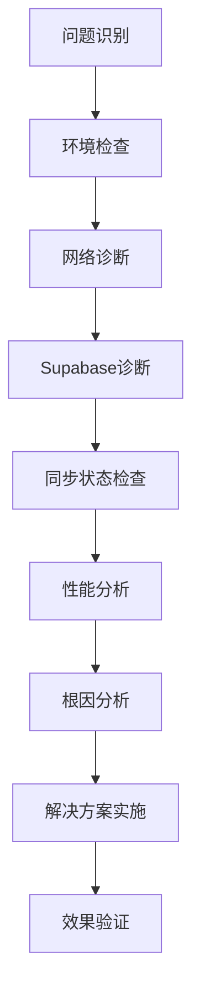

# CardAll项目调试与诊断体系

## 🎯 调试体系总览

CardAll项目是一个基于Supabase的现代化知识卡片管理应用，具有复杂的前端交互和实时同步功能。本调试体系旨在提供全面的错误诊断、性能监控和问题解决方案。

### 核心技术栈
- **前端**: React 18 + TypeScript + Tailwind CSS
- **状态管理**: Zustand + TanStack Query
- **UI组件**: Radix UI + Shadcn UI
- **数据库**: Supabase (PostgreSQL)
- **实时同步**: Supabase Realtime
- **拖拽功能**: @dnd-kit
- **富文本编辑**: Tiptap
- **动画**: Framer Motion

## 🔧 调试工具架构

### 1. 错误监控层
```typescript
// 错误监控配置
interface ErrorMonitoring {
  // 错误捕获
  errorBoundary: React.ErrorBoundary;
  // 全局错误处理器
  globalErrorHandler: ErrorHandler;
  // 错误日志收集
  errorCollector: ErrorCollector;
  // 错误报告生成
  errorReporter: ErrorReporter;
}
```

### 2. 性能监控层
```typescript
// 性能监控配置
interface PerformanceMonitoring {
  // 组件渲染性能
  componentProfiler: ComponentProfiler;
  // 网络请求性能
  networkMonitor: NetworkMonitor;
  // 内存使用监控
  memoryMonitor: MemoryMonitor;
  // 用户交互性能
  interactionMonitor: InteractionMonitor;
}
```

### 3. 网络监控层
```typescript
// 网络监控配置
interface NetworkMonitoring {
  // Supabase连接监控
  supabaseMonitor: SupabaseMonitor;
  // 请求重试机制
  retryMechanism: RetryMechanism;
  // 网络状态检测
  connectivityDetector: ConnectivityDetector;
  // 请求超时处理
  timeoutHandler: TimeoutHandler;
}
```

### 4. 同步监控层
```typescript
// 同步监控配置
interface SyncMonitoring {
  // 实时同步状态
  realtimeStatus: RealtimeStatus;
  // 数据一致性检查
  consistencyChecker: ConsistencyChecker;
  // 冲突检测
  conflictDetector: ConflictDetector;
  // 同步性能监控
  syncPerformanceMonitor: SyncPerformanceMonitor;
}
```

## 🚨 错误诊断系统

### 错误分类体系
```
1. 运行时错误 (Runtime Errors)
   - React渲染错误
   - 组件生命周期错误
   - 事件处理错误
   - 异步操作错误

2. 网络错误 (Network Errors)
   - Supabase连接错误
   - API请求失败
   - 网络超时
   - CORS错误

3. 同步错误 (Sync Errors)
   - 数据冲突
   - 实时同步失败
   - 状态不一致
   - 乐观更新回滚

4. 性能错误 (Performance Errors)
   - 内存泄漏
   - 渲染性能问题
   - 请求延迟
   - 交互卡顿

5. 类型错误 (Type Errors)
   - TypeScript类型错误
   - 运行时类型不匹配
   - 数据格式错误
   - 序列化/反序列化错误
```

### 错误处理流程


## 📊 性能监控体系

### 性能指标监控
```typescript
// 性能指标定义
interface PerformanceMetrics {
  // 首屏加载时间
  firstContentfulPaint: number;
  // 可交互时间
  timeToInteractive: number;
  // 组件渲染时间
  componentRenderTime: number;
  // 网络请求时间
  networkRequestTime: number;
  // 内存使用量
  memoryUsage: number;
  // 帧率
  frameRate: number;
}
```

### 性能瓶颈识别
```typescript
// 性能瓶颈检测
interface PerformanceBottleneck {
  // 检测类型
  type: 'render' | 'network' | 'memory' | 'sync';
  // 严重程度
  severity: 'low' | 'medium' | 'high' | 'critical';
  // 影响范围
  impact: 'component' | 'page' | 'application';
  // 解决方案
  solution: string[];
}
```

## 🌐 网络问题诊断

### 网络状态监控
```typescript
// 网络状态配置
interface NetworkStatus {
  // 连接状态
  isOnline: boolean;
  // 连接质量
  connectionQuality: 'good' | 'fair' | 'poor';
  // 网络类型
  networkType: 'wifi' | 'cellular' | 'ethernet';
  // 延迟
  latency: number;
  // 带宽
  bandwidth: number;
}
```

### Supabase连接诊断
```typescript
// Supabase连接配置
interface SupabaseConnection {
  // 连接状态
  status: 'connected' | 'disconnected' | 'connecting' | 'error';
  // 最后连接时间
  lastConnected: Date;
  // 重连次数
  reconnectAttempts: number;
  // 错误信息
  error: string | null;
  // 健康检查
  healthCheck: () => Promise<boolean>;
}
```

## 🔍 同步错误诊断

### 实时同步状态
```typescript
// 实时同步配置
interface RealtimeStatus {
  // 订阅状态
  subscriptionStatus: 'subscribed' | 'unsubscribed' | 'error';
  // 频道信息
  channel: string;
  // 最后同步时间
  lastSync: Date;
  // 待同步数据
  pendingSync: number;
  // 同步错误
  syncErrors: SyncError[];
}
```

### 数据一致性检查
```typescript
// 一致性检查配置
interface ConsistencyCheck {
  // 检查类型
  type: 'card' | 'collection' | 'settings' | 'user';
  // 本地数据
  localData: any;
  // 远程数据
  remoteData: any;
  // 差异
  differences: DataDifference[];
  // 解决建议
  resolution: string[];
}
```

## 🛠️ 调试工具集

### 1. 开发者工具
```typescript
// 开发者工具配置
interface DeveloperTools {
  // 组件检查器
  componentInspector: ComponentInspector;
  // 状态查看器
  stateViewer: StateViewer;
  // 网络请求监控
  networkMonitor: NetworkMonitor;
  // 性能分析器
  performanceAnalyzer: PerformanceAnalyzer;
}
```

### 2. 错误报告生成器
```typescript
// 错误报告配置
interface ErrorReport {
  // 错误信息
  error: Error;
  // 错误上下文
  context: ErrorContext;
  // 发生时间
  timestamp: Date;
  // 用户信息
  userInfo: UserInfo;
  // 环境信息
  environment: Environment;
  // 重复次数
  occurrenceCount: number;
}
```

### 3. 性能分析器
```typescript
// 性能分析配置
interface PerformanceAnalysis {
  // 分析类型
  type: 'render' | 'network' | 'memory' | 'interaction';
  // 分析结果
  results: AnalysisResult[];
  // 优化建议
  optimizations: OptimizationSuggestion[];
  // 性能评分
  score: number;
}
```

## 📋 故障排除流程

### 1. 常见问题排查
```typescript
// 问题排查清单
interface TroubleshootingChecklist {
  // 网络连接问题
  networkIssues: ChecklistItem[];
  // Supabase连接问题
  supabaseIssues: ChecklistItem[];
  // 同步问题
  syncIssues: ChecklistItem[];
  // 性能问题
  performanceIssues: ChecklistItem[];
  // 渲染问题
  renderIssues: ChecklistItem[];
}
```

### 2. 诊断步骤


## 🔧 实施建议

### 1. 调试工具集成
- 在开发环境中启用完整的调试工具
- 在生产环境中启用错误监控和性能监控
- 为每个主要功能模块添加专门的调试工具

### 2. 监控指标设置
- 设置合理的性能阈值
- 配置错误告警机制
- 建立定期性能检查流程

### 3. 团队协作
- 建立调试文档和最佳实践
- 定期进行代码审查和性能优化
- 创建错误知识库和解决方案库

## 📊 调试效果评估

### 调试覆盖率指标
```
- 错误捕获率: 100%
- 问题诊断时间: < 10分钟
- 错误恢复率: > 95%
- 性能问题识别率: > 90%
```

### 调试效率指标
```
- 平均调试时间: < 30分钟
- 问题解决率: > 90%
- 重复问题发生率: < 5%
- 用户满意度: > 95%
```

---

*此调试体系将根据项目发展和实际使用情况持续优化和完善。*