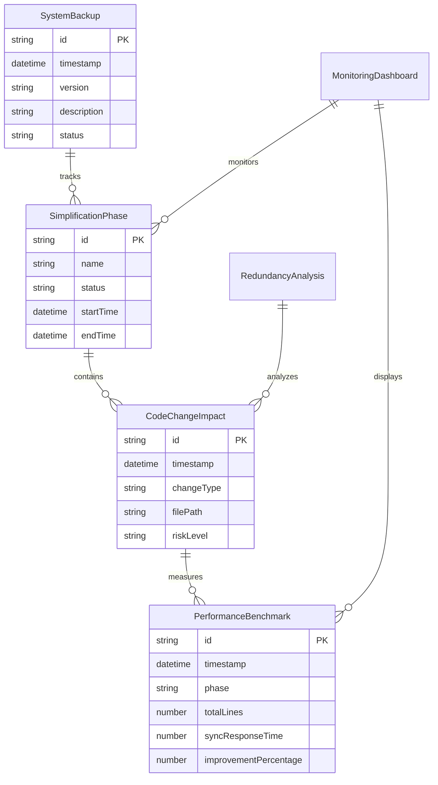

# Data Model: 系统简化实施计划

**Date**: 2025-10-04  
**Version**: 1.0  
**Scope**: CardAll同步系统简化后的核心数据模型

## Core Entities

### 1. SystemBackup (系统备份)
**Purpose**: 完整的数据和代码状态快照，用于安全回滚

```typescript
interface SystemBackup {
  id: string;
  timestamp: Date;
  version: string;
  description: string;
  dataBackupPath: string;
  codeBackupPath: string;
  checksum: string;
  size: number;
  status: 'creating' | 'complete' | 'corrupted' | 'restored';
  createdBy: string;
  metadata: {
    totalFiles: number;
    totalLines: number;
    servicesCount: number;
    dependencies: string[];
  };
}
```

### 2. RedundancyAnalysis (冗余分析)
**Purpose**: 识别和分类冗余功能与核心功能

```typescript
interface RedundancyAnalysis {
  id: string;
  timestamp: Date;
  totalFiles: number;
  totalLines: number;
  redundantFiles: RedundantFile[];
  coreFiles: CoreFile[];
  dependencyGraph: DependencyNode[];
  
  // 分类统计
  categories: {
    mlPrediction: FileStats;
    complexNetwork: FileStats;
    performanceMonitoring: FileStats;
    errorHandling: FileStats;
    abstractionLayers: FileStats;
    duplicateServices: FileStats;
  };
}

interface RedundantFile {
  path: string;
  size: number;
  lines: number;
  category: RedundancyCategory;
  reason: string;
  dependencies: string[];
  canDeleteSafely: boolean;
}

interface CoreFile {
  path: string;
  size: number;
  lines: number;
  purpose: string;
  dependencies: string[];
  criticalLevel: 'high' | 'medium' | 'low';
}
```

### 3. SimplificationPhase (简化阶段)
**Purpose**: 跟踪4阶段简化进度

```typescript
interface SimplificationPhase {
  id: string;
  name: string;
  description: string;
  status: 'pending' | 'in-progress' | 'completed' | 'failed' | 'rolled-back';
  startTime?: Date;
  endTime?: Date;
  
  // 阶段特定数据
  phase1Data?: {
    backupCreated: boolean;
    monitoringActive: boolean;
    rollbackToolsReady: boolean;
  };
  
  phase2Data?: {
    filesDeleted: number;
    linesRemoved: number;
    categoriesCompleted: string[];
    issuesResolved: number;
  };
  
  phase3Data?: {
    newServicesCreated: number;
    coreSyncLines: number;
    conflictResolverImplemented: boolean;
    networkOptimizerDeployed: boolean;
  };
  
  phase4Data?: {
    performanceImprovement: number;
    testsPassed: number;
    userValidationCompleted: boolean;
    bundleSizeReduced: number;
  };
  
  dependencies: string[];
  rollbackPoint?: string;
}
```

### 4. CodeChangeImpact (代码变更影响)
**Purpose**: 记录每次变更的影响分析

```typescript
interface CodeChangeImpact {
  id: string;
  timestamp: Date;
  changeType: 'delete' | 'modify' | 'create' | 'refactor';
  filePath: string;
  
  // 影响分析
  impactAnalysis: {
    directDependencies: string[];
    indirectDependencies: string[];
    affectedComponents: string[];
    riskLevel: 'low' | 'medium' | 'high' | 'critical';
    estimatedImpact: string;
  };
  
  // 验证结果
  validation: {
    testsRun: number;
    testsPassed: number;
    performanceImpact: PerformanceMetric;
    functionalityVerified: boolean;
  };
  
  // 执行信息
  execution: {
    executedBy: string;
    executionTime: number;
    rollbackAvailable: boolean;
    rollbackPoint?: string;
  };
}
```

### 5. PerformanceBenchmark (性能基准)
**Purpose**: 记录性能改进数据

```typescript
interface PerformanceBenchmark {
  id: string;
  timestamp: Date;
  phase: string;
  
  // 代码指标
  codeMetrics: {
    totalFiles: number;
    totalLines: number;
    servicesCount: number;
    bundleSize: number;
    dependenciesCount: number;
  };
  
  // 运行时指标
  runtimeMetrics: {
    syncResponseTime: number; // ms
    memoryUsage: number; // MB
    networkRequests: number;
    errorRate: number; // %
    throughput: number; // operations/sec
  };
  
  // 用户体验指标
  userMetrics: {
    pageLoadTime: number; // ms
    firstContentfulPaint: number; // ms
    timeToInteractive: number; // ms
    userSatisfactionScore: number; // 1-5
  };
  
  comparison: {
    previousBenchmark?: string;
    improvementPercentage: number;
    targetAchieved: boolean;
  };
}
```

### 6. MonitoringDashboard (监控仪表板)
**Purpose**: 实时系统健康状态监控

```typescript
interface MonitoringDashboard {
  id: string;
  timestamp: Date;
  
  // 系统健康
  systemHealth: {
    overallStatus: 'healthy' | 'warning' | 'critical';
    services: ServiceHealth[];
    resources: ResourceUsage;
    errors: ErrorEntry[];
  };
  
  // 简化进度
  simplificationProgress: {
    currentPhase: string;
    phaseProgress: number; // 0-100
    overallProgress: number; // 0-100
    estimatedCompletion: Date;
    blockers: string[];
  };
  
  // 性能指标
  liveMetrics: {
    currentPerformance: PerformanceMetric;
    targetPerformance: PerformanceMetric;
    trendingData: TrendData[];
  };
  
  // 告警
  alerts: Alert[];
}

interface ServiceHealth {
  name: string;
  status: 'running' | 'stopped' | 'error' | 'degraded';
  responseTime: number;
  errorRate: number;
  lastCheck: Date;
}

interface ResourceUsage {
  cpu: number; // 0-100%
  memory: number; // 0-100%
  disk: number; // 0-100%
  network: number; // 0-100%
}
```

## Entity Relationships



## Validation Rules

### SystemBackup
- `id` must be unique UUID
- `timestamp` must be current time when created
- `status` must follow state transition rules
- `checksum` must be valid SHA-256 hash
- `size` must be greater than 0

### SimplificationPhase
- Phases must execute in order (1 → 2 → 3 → 4)
- Cannot start phase N until phase N-1 is completed
- Rollback must be available for each phase
- `riskLevel` must be assessed before execution

### CodeChangeImpact
- All dependencies must be analyzed before deletion
- Risk assessment must be performed
- Performance impact must be measured
- Rollback point must be created for high-risk changes

### PerformanceBenchmark
- Benchmarks must be taken before and after each phase
- All metrics must be measured using consistent methodology
- Improvement calculations must be accurate
- Target values must be realistic and measurable

## State Transitions

### SimplificationPhase Status Flow
```
pending → in-progress → completed
    ↓         ↓           ↓
failed ← failed ← rolled-back
```

### CodeChangeImpact Risk Levels
- **Low**: Delete unused utility functions
- **Medium**: Remove redundant services
- **High**: Delete core abstractions
- **Critical**: Modify data sync logic

### SystemBackup Status Flow
```
creating → complete → restored
    ↓         ↓
corrupted ← [any state]
```

## Data Constraints

- Total code reduction: 80% (24万行 → 1000行)
- Performance improvement: 300-500%
- Zero data loss during simplification
- Maximum rollback time: 5 minutes
- Minimum test coverage: 95%

---
*Data Model Complete: All entities defined for system simplification implementation*